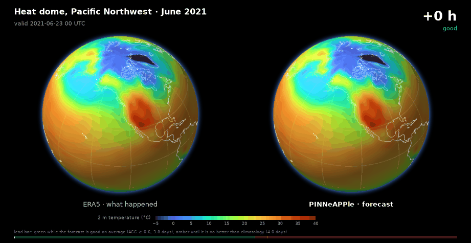
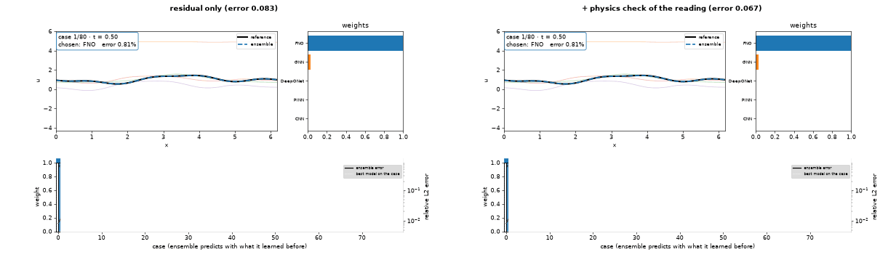
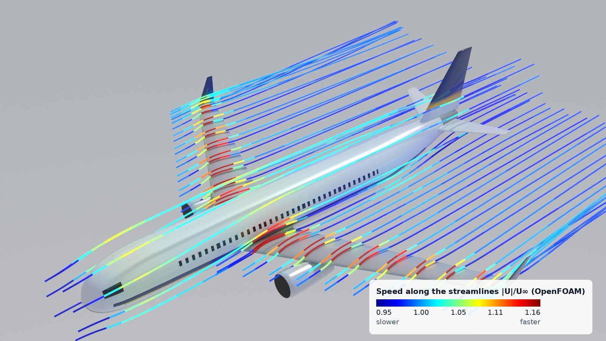
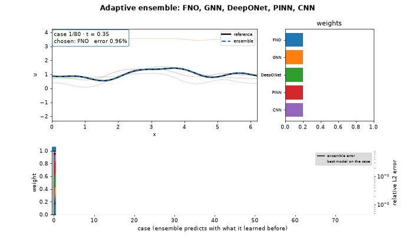
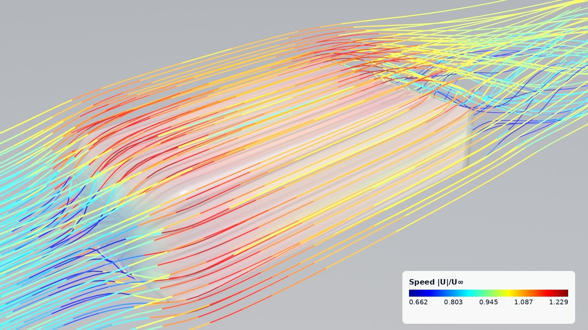
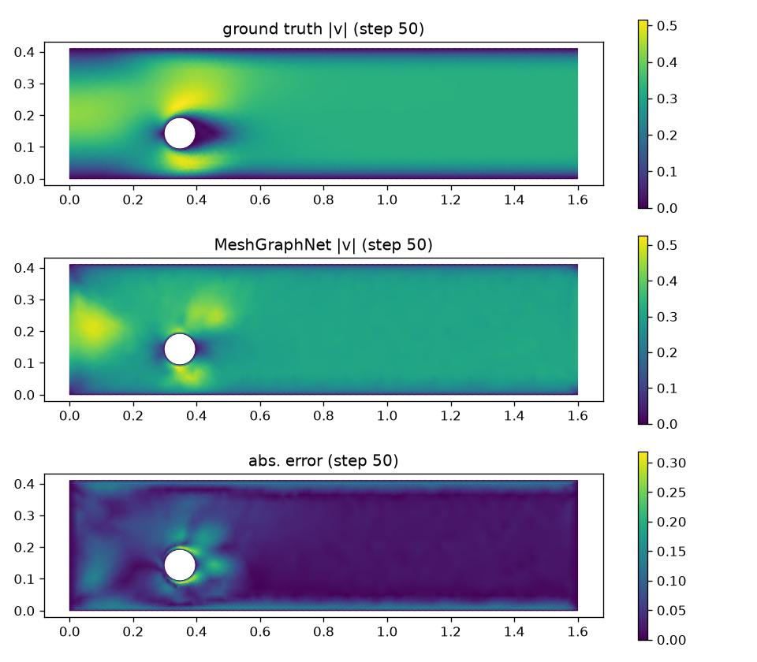
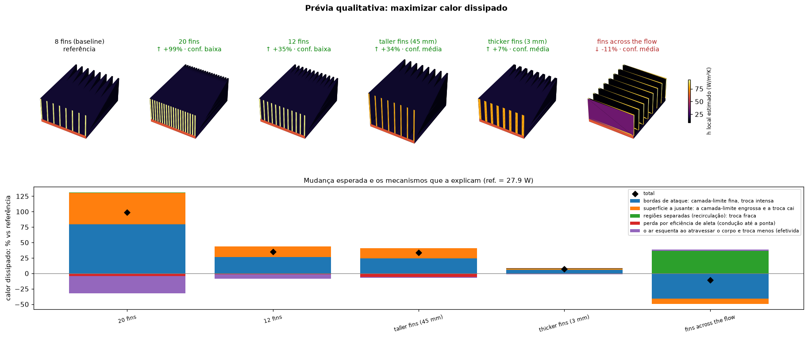
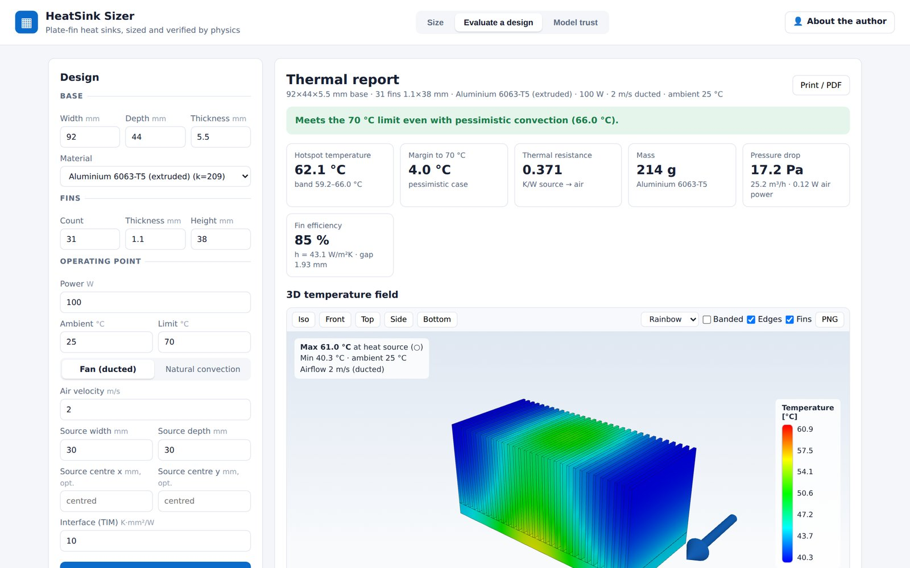
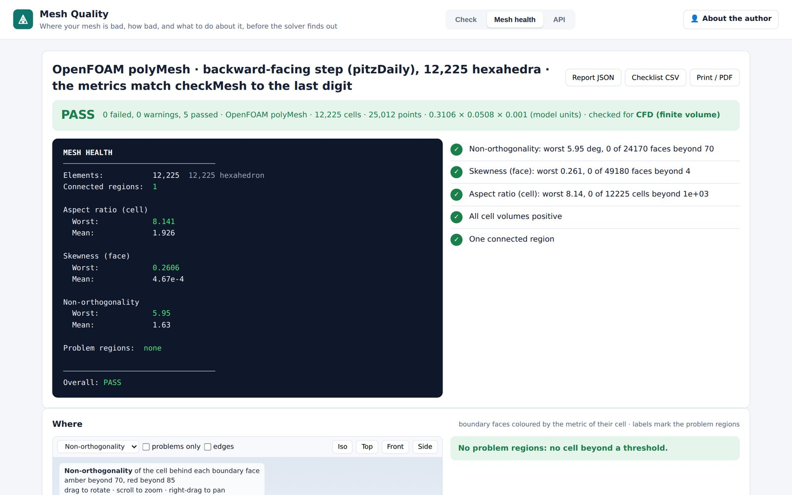
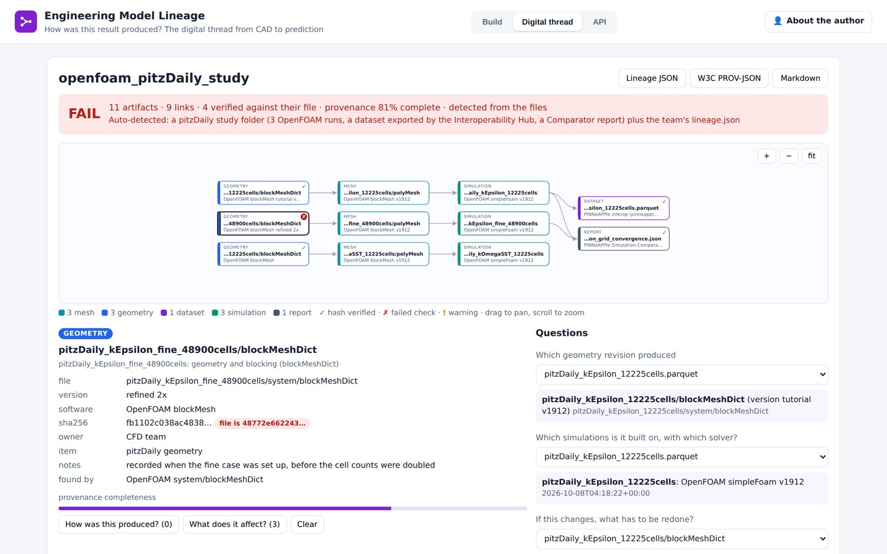

<div align="center">

# PINNeAPPle 🍍

### Physics AI that tells you when to trust it

**Solve, simulate, forecast and design with physics-informed AI — and know, for every prediction, whether it still holds.**

[](https://github.com/PINNeAPPle-Labs/PINNeAPPle/actions/workflows/tests.yml)
[](https://pypi.org/project/pinneapple/)
[](LICENSE)



<sub>A global forecast model trained with <code>pinneapple_physics.weather</code> on public ERA5, against what happened (2021 Pacific Northwest heat dome). The lead bar turns amber when the forecast stops being trustworthy. Preview weights, training in progress (<a href="https://github.com/PINNeAPPle-Labs/PINNeAPPle/issues/322">#322</a>).</sub>

</div>

---

## What makes it different

Most Physics AI libraries stop at the prediction. PINNeAPPle adds a **trust layer**, so a model can say how good it is right now:

- **"This model just left its domain."** Every model's PDE residual on the current case, compared with its level in its own domain, switches the ensemble on the **first** case of a new regime instead of after errors pile up.
- **"That was the sensor, not the process."** A physics check of the reading itself keeps sensor noise from switching models or teaching them anything.
- **"Trust this forecast for 3.8 days."** Skill by lead time and a useful horizon for every forecast, next to the operational models.
- **"Here is the evidence."** Conservation and boundary-condition checks, uncertainty, provenance and a decision layer that only learns from verified results.

<div align="center">

| | |
|:---:|:---:|
|  |  |
| **Regime change or sensor noise?** Five model families (FNO, GNN, DeepONet, PINN, CNN); with the physics check of the reading (right), noisy readings never switch the model. | **OpenFOAM in the loop.** An airliner designed and optimised in the library, verified with 3D RANS; streamlines coloured by speed. |
|  |  |
| **Adaptive physics ensembles.** The model chosen on each case against the exact field, as the regime drifts. | **External aerodynamics from any STL.** The Ahmed body, meshed and solved automatically. |
|  |  |
| **Neural operators and graph networks.** A MeshGraphNet rollout of the flow past a cylinder against the solver. | **Qualitative preview before any solver.** Which design change should help, by which mechanism, and how sure it is. |

</div>

---

## Install

```bash
pip install pinneapple
pip install "pinneapple[all]"     # every optional backend (solvers, geometry, FEniCS, ONNX, ...)
```

## Five things to try

<details open>
<summary><b>1. Solve a PDE and compare against the exact solution</b></summary>

```python
import pinneapple as pp

prob = pp.PhysicalProblem.from_preset("burgers_1d", nu=0.01 / 3.141592653589793)
exact = pp.solve(prob, "analytic")                      # Cole-Hopf closed form
pinn = pp.solve(prob, "pinn", epochs=4000)            # physics-informed network
print(pp.compare(prob, ["pinn"], reference="analytic", options={"pinn": {"epochs": 4000}}))
```
`pp.Experiment(...).run()` records the result with the problem's fingerprint; add your own method with `@pp.register_method("name")`.
</details>

<details>
<summary><b>2. An ensemble that notices a regime change on its first case</b></summary>

```python
import numpy as np
from pinneapple_physics.advection_diffusion_1d import AdvectionDiffusion1D
from pinneapple_physics.ensemble import PhysicsEnsemble, from_callable

ad = AdvectionDiffusion1D()                             # u_t + c u_x = nu u_xx, exact solutions
experts = [from_callable("surrogate A (built for nu=0.01)", lambda q: ad.exact({**q, "nu": 0.01})),
           from_callable("surrogate B (built for nu=0.2)", lambda q: ad.exact({**q, "nu": 0.2})),
           from_callable("upwind scheme", lambda q: ad.finite_difference(q, "upwind"))]

rng = np.random.default_rng(0)                          # the diffusivity jumps half way: a regime change
cases = [ad.random_case(rng, nu) for nu in [0.01] * 30 + [0.2] * 30]

def implausible(q):                                     # physics on the reading itself: energy a real state lacks
    e = np.abs(np.fft.rfft(q["u0"])) ** 2
    return e[8:].sum() / e.sum() > 1e-4

ens = PhysicsEnsemble(experts, mode="select",
                      residual_fn=ad.residual, residual_lookahead=2.0,   # switch on the first new case
                      measurement_check=implausible)                     # sensor noise never switches it
run = ens.run(cases, [ad.exact(q) for q in cases])
print(run.switches(), run.summary()["ensemble"])
```
Output: `[(0, 'surrogate A (built for nu=0.01)'), (30, 'surrogate B (built for nu=0.2)')] 0.0`. The switch is at case 30, the first case of the new regime. Without `residual_lookahead` it takes five cases, and the error is 0.0103. See [docs/core_concepts/physics_ensembles.md](docs/core_concepts/physics_ensembles.md).
</details>

<details>
<summary><b>3. Know which design change should help, before simulating</b></summary>

```python
from pinneapple_design.geometry.bodies import box
from pinneapple_design.qualitative import Assembly, preview

def heat_sink(n_fins):                                  # base + fins along the flow (x), metres
    parts = {"base": box((0.08, 0.06, 0.004), (0.04, 0, 0.002))}
    for i in range(n_fins):
        y = -0.03 + 0.00075 + i * (0.06 - 0.0015) / (n_fins - 1)
        parts[f"fin{i}"] = box((0.08, 0.0015, 0.03), (0.04, y, 0.019))
    return Assembly(parts)

p = preview({"8 fins": heat_sink(8), "20 fins": heat_sink(20)}, "maximize heat rejection",
            conditions={"U": 2.0, "dT": 40.0, "base_part": "base"}, lang="en")
print(p.text())                                         # direction, mechanisms, confidence, before any solver
```
Then `p.quantify(...)` runs the accurate physics on the variants worth it and reports where the qualitative reading was right ([examples/qualitative](examples/qualitative)).
</details>

<details>
<summary><b>4. A 3D digital twin in the browser</b></summary>

```python
import numpy as np, trimesh
from pinneapple_twin3d import Scene

pipe = trimesh.creation.cylinder(radius=0.05, height=1.0, sections=48)
wear = np.linspace(0, 1, 3)[:, None] * np.abs(pipe.vertices[:, 2])[None, :]     # (time, vertex)
sc = Scene("Pipe wear", times=[0, 1, 2], time_unit="year")
sc.add_trimesh("pipe", pipe, group="line A")
sc.add_field("pipe", "wear_depth", wear, unit="mm")
sc.add_sensor("PT-101", (0.0, 0.06, 0.3), unit="bar", series=[4.1, 4.0, 3.8], envelope=(3.5, 5.0))
sc.export("out/pipe_twin")                                          # scene.json + geometry.glb + fields.bin + web viewer
```
Open `out/pipe_twin/index.html`: geometry, the field over time, sensors with their operating envelopes. USD export for Omniverse with `usd=True`.
</details>

<details>
<summary><b>5. A global weather forecast, Earth-2 style</b></summary>

```python
from pinneapple_physics.weather.data import download, Era5Store
from pinneapple_physics.weather.train import Forecaster
from pinneapple_physics.weather.viz import earth2_gif

ck = "examples/weather_forecasting/checkpoints/"
store = Era5Store(download("wx/era5", (2021, 2021), normalization=ck + "era5_64x32_normalization.json"))  # public ERA5
fc = Forecaster.load(ck + "phase1_step15000_fp16.pt", store)

i = store.index("2021-06-23T00")                        # five days before the 2021 heat dome
x = store.state[i - 1:i + 1]
f = store.denorm(fc.rollout(x[1], x[0], store.times[i], steps=24)[0])           # 6 days, every 6 h
t = store.denorm(store.state[i:i + 25])
c = store.channels.index("t2m")
earth2_gif("heat_dome.gif", "t2m", t[:, c], f[:, c], store.lat, store.lon, store.times[i:i + 25],
           lead_hours=range(0, 145, 6), horizon={"useful_hours": 91, "no_skill_hours": 96},
           title="Heat dome, June 2021", center=(42, -128))
```
ERA5 comes from the public WeatherBench2 bucket, no account needed. To finish training and score against IFS HRES, Pangu-Weather and NeuralGCM, see [examples/weather_forecasting](examples/weather_forecasting).
</details>

---

## Module map

```
PINNeAPPle
│
├── Problems and physics
│   ├── pinneapple_core           Field, Mesh, Domain, Geometry: shared primitives
│   ├── pinneapple_physics        PDE specs and presets, PINN compiler, SymPy → autograd, closed forms,
│   │                             adaptive physics ensembles, global weather forecasting (ERA5)
│   └── pinneapple_problemdesign  plain-language problem → PDE spec (elicitation, knowledge base, codegen)
│
├── Models and training
│   ├── pinneapple_neural         SIREN, FNO, DeepONet, AFNO, MeshGraphNet, transformers, recurrent, reservoir,
│   │                             ROMs, ...; trainers (DDP, causal, two-phase); predictors; PhysicsNeMo bridge
│   ├── pinneapple_adaptation     transfer learning and meta-learning (MAML, Reptile) across PDE families
│   ├── pinneapple_quantum        variational quantum circuits with PDE losses (VQ-PINN), simulators and hardware
│   └── pinneapple_worldmodel     a physics foundation model trained across domains, synthetic data factory
│
├── Simulation
│   ├── pinneapple_simulation     FEM, FDM, FVM, spectral, SPH, LBM, MPM; OpenFOAM, FEniCS, CalculiX, FMU bridges;
│   │                             geophysics
│   └── pinneapple_systems        time series, co-simulation graphs, digital twins (EKF/EnKF), process components
│
├── Trust, verification and decisions
│   ├── pinneapple_analysis       uncertainty, validation, verification, inverse problems, data assimilation,
│   │                             state estimation, trust and cost
│   ├── pinneapple_decision       probabilistic decision layer: which experiment next, under hard constraints,
│   │                             learning only from verified results
│   └── pinneapple_security       manifests, signatures, provenance (in-toto/SLSA), SBOM, audit trail, privacy,
│                                 physics-residual detection of manipulated sensor data
│
├── Data and perception
│   ├── pinneapple_data           datasets, CAE mesh and field I/O, simulation metadata, preflight, lineage, synthesis
│   ├── pinneapple_perception     physics from images, video and audio (PIV, geometry, modal frequencies)
│   ├── pinneapple_pdb            physics database: templates, shards, derived quantities, benchmarks
│   └── pinneapple_catalog        what the library knows about, with sources
│
├── Design
│   └── pinneapple_design         SDF/CSG geometry, aero (VLM, airliner), thermal (heat sinks), qualitative preview,
│                                 adjoint, Bayesian and evolutionary optimisation
│
├── Visualisation and experience
│   ├── pinneapple_twin3d         3D digital twins in the browser (glTF/USD), OpenFOAM scenes, scans
│   ├── pinneapple_blender        fields and trajectories to Blender, Cycles renders
│   ├── pinneapple_tools          plots, model export (ONNX, TorchScript), HPO, benchmark suite, sandboxes
│   └── pinneapple_app            web app for benchmarking models on physics problems
│
└── Operations
    ├── pinneapple_arena          YAML-driven multi-model benchmarks (80+ architectures)
    ├── pinneapple_registry       self-hosted model and dataset registry, experiment tracking
    ├── pinneapple_hub            push_to_hub / from_pretrained with model cards
    ├── pinneapple_orchestration  Prefect pipelines
    └── pinneapple_llm            LLM-drafted pipelines gated by a physics guardrail
```

`pinneapple_models`, `pinneapple_solvers` and `pinneapple_train` are compatibility aliases of the modules above.

---

## Use cases you can run

| Area | Example | What it shows |
|---|---|---|
| Weather | [`examples/weather_forecasting`](examples/weather_forecasting) | Global ERA5 model, skill by lead against IFS/Pangu/NeuralGCM, seven extreme events |
| Ensembles | [`examples/physics_ensemble`](examples/physics_ensemble) | Five model families, regime detection, sensor noise against regime change |
| Aerodynamics | [`apps/aero_optimizer`](apps/aero_optimizer), [`examples/use_cases/concorde_high_aoa`](examples/use_cases/concorde_high_aoa), [`examples/use_cases/missile_aero`](examples/use_cases/missile_aero) | Design optimisation with OpenFOAM verification, high angle of attack |
| Thermal | [`apps/heatsink_sizer`](apps/heatsink_sizer), [`apps/pcb_hotspot`](apps/pcb_hotspot), [`examples/use_cases/fin_convection_inverse`](examples/use_cases/fin_convection_inverse) | Sizing, hot spots, inverse convection |
| Structures | [`examples/use_cases/solid_mechanics`](examples/use_cases/solid_mechanics), [`examples/use_cases/crash_surrogate`](examples/use_cases/crash_surrogate), [`examples/calculix_cantilever`](examples/calculix_cantilever) | FEM surrogates, crash, CalculiX bridge |
| Digital twins | [`examples/use_cases/heated_channel_twin`](examples/use_cases/heated_channel_twin), [`examples/use_cases/drill_pipe_surrogate`](examples/use_cases/drill_pipe_surrogate) | Live twins, surrogates in the loop |
| Field robotics | [`examples/use_cases/terramechanics`](examples/use_cases/terramechanics) | Wheel-soil physics |
| Synthetic data | [`examples/use_cases/physics_data_factory`](examples/use_cases/physics_data_factory) | Simulation → rendered images for training |
| Design | [`examples/qualitative`](examples/qualitative) | Qualitative preview, then the quantitative check |

The Engineering Apps in [`apps/`](apps) (heat-sink sizer, PCB hot spots, mesh quality, simulation preflight and comparator, model lineage, interoperability hub, ...) are FastAPI services with a web front end, built on the library.

<div align="center">

| | | |
|:---:|:---:|:---:|
|  |  |  |
| Heat-sink sizer | Mesh quality | Model lineage |

</div>

---

## Roadmap

New application areas, each entering the same way (a real problem with public data, a known baseline, the trust questions, a GIF and an honest table, then the API): [#327](https://github.com/PINNeAPPle-Labs/PINNeAPPle/issues/327).

- satellite thunderstorm nowcasting;
- robotics with physics-verified model switching;
- drones (flight safety, and the drone as a sensor);
- river discharge from smartphone video;
- flood and fire mapping;
- batteries;
- manufacturing drift;
- structural health;
- agriculture;
- physics verification as a service.

---

## Philosophy

> *If you can't validate it, you shouldn't deploy it.*

Correct formulations, reliable validation, understanding failure modes, and decisions made on evidence.

## Citation

```bibtex
@software{pinneapple2026,
  title        = {PINNeAPPle: An Open-Source Physics AI Research and Experimentation Platform},
  author       = {Barros, Yan and Contributors},
  year         = {2026},
  url          = {https://github.com/PINNeAPPle-Labs/PINNeAPPle},
  version      = {0.6.3}
}
```

If this project makes sense to you, **give it a star** ⭐: it helps grow the ecosystem and attract contributors.

<div align="center"><sub>Built for researchers and engineers who take physics seriously.</sub></div>
