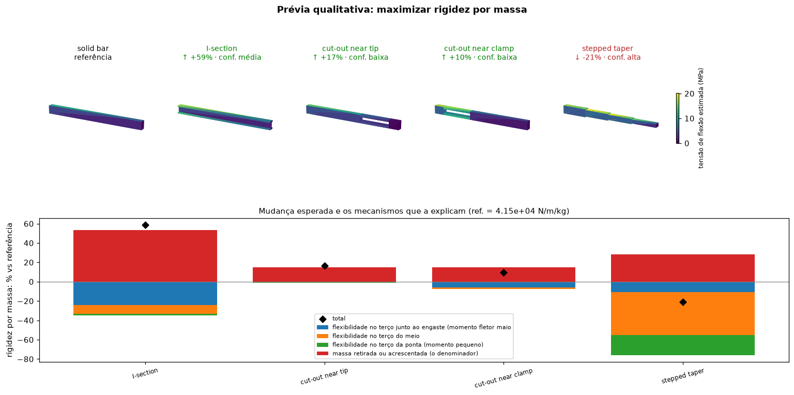
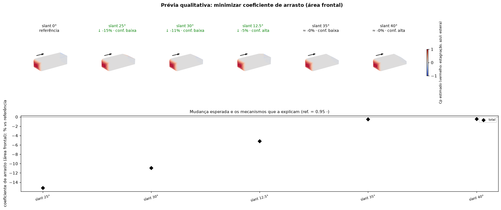

# Qualitative preview: physical impact of geometry changes before the numbers

`pinneapple_design.qualitative` (also `pp.qualitative`) answers the question an engineer asks before any
simulation: *given these geometries, or this change to one part, which way should the result move, how strongly,
and why?* It reads the geometry (closed triangulated bodies, or an `Assembly` of named parts), applies cheap
physical models face by face, and returns for each variant:

- the **direction and strength** of the change of the objective (negligible < 3 %, slight < 10 %, moderate < 30 %,
  strong);
- the **mechanisms** that move it and by how much relative to each other (stagnation, separation, friction; leading
  edges, boundary-layer growth, the air heating up, fin efficiency, wake; flexibility near the clamp, mid-span or tip,
  mass);
- the **parts** that contributed most;
- **side effects** on the other quantities of the same physics (less drag but more lift; more cooling but more mass);
- a **confidence** level with the reasons it is lowered (close to a separation angle, transition Reynolds number,
  merged boundary layers between fins, a section split into separate pieces, a short beam, a large extrapolation);
- a **surface map** of where the physics happens (estimated Cp, local convection coefficient, bending stress).

Only then comes the quantitative step: `quantify` runs an accurate computation on the variants worth it and reports
where the qualitative reading was right.

```python
from pinneapple_design.qualitative import Assembly, part_sensitivity, preview

p = preview({"8 fins": sink8, "12 fins": sink12, "taller": sink_tall, "fins across the flow": sink_across},
            "maximizar dissipação de calor", conditions={"U": 2.0, "dT": 40, "base_part": "base"})
print(p.text())               # Portuguese by default; p.text(lang="en")
p.figure("preview.png")
print(part_sensitivity(sink8, "maximizar dissipação de calor", {"U": 2.0, "base_part": "base"}).text())
check = p.quantify(lambda name, geom: accurate_conductance(geom))     # CFD, FEM, pp.solve, test data...
print(check.text())          # expected vs computed, direction right?, rank correlation
```

Objectives are read from plain text in Portuguese or English ("minimizar arrasto", "more downforce", "aumentar
rigidez por massa", "reduce the thermal resistance", "aumentar a primeira frequência") or given as
`(quantity, "min" | "max")`.

## Models

| model | quantities | physics |
|---|---|---|
| `ExternalFlow` | drag, drag coefficient, lift, separated wake area | modified Newtonian pressure on windward faces, pressure recovery on gently inclined leeward faces, base pressure beyond the separation angle and on faces sheltered behind others, flat-plate skin friction (Hoerner) |
| `ConvectiveCooling` | heat rejected, thermal resistance, mean h, cooling time constant, mass | local flat-plate laws from each part's leading edge, stagnation law on blunt faces, weaker exchange in separated or sheltered regions, natural convection (vertical plate), fin efficiency tanh(mL)/mL, air heating across the body (effectiveness-NTU) |
| `Cantilever` | tip deflection, stiffness, max bending stress, safety factor, mass, stiffness per mass, first frequency | non-uniform Euler-Bernoulli beam with section properties from a voxelization, Rayleigh quotient |
| `ScalingModel` | any formula of the descriptors | your own scaling law; changes are attributed to the descriptors that moved |

Quantitative counterparts: `pinneapple_design.qualitative.quantitative.voxel_fem_cantilever` (3-D linear elasticity
on the voxelized shape with incompatible-mode bricks: within 3 % of Timoshenko beam theory, no shear locking) and,
for plate-fin heat sinks, the HeatSink Sizer physics (`pinneapple_design.thermal.heatsink.engine.physics_resistance`).

## Three worked examples (`examples/qualitative/`)

**Heat-sink fins** (`01_heat_sink_fins.py`): more fins, taller, thicker, and fins across the flow. The preview
explains every gain through the leading edges and the boundary-layer growth and every loss through the air heating up
and the fin efficiency; it flags the merged boundary layers between tight fins (lower confidence) and says the
fins-across-the-flow design loses heat rejection, because the downstream fins sit in the wake, a case the
quantitative tool cannot evaluate at all. Against the HeatSink Sizer physics: right direction for all variants, rank
correlation 1.0 (it underestimates the gain of many fins, where its confidence was low).


**Beam stiffness per mass** (`02_beam_stiffness_per_mass.py`): solid bar, I-section, stepped taper, cut-outs near
the clamp or the tip, checked with the voxel FEM. Right for the I-section and the taper; wrong for the cut-outs,
which beam theory treats as if the two strips acted as one section, and the preview had already given them low
confidence for that reason.



**Ahmed body slant** (`03_ahmed_slant.py`), against the wind-tunnel data of Ahmed et al. (1984): right below 20
degrees and above 35, wrong between 25 and 35, where longitudinal vortices that the model does not have raise the
drag; again the confidence there was low. This is the point of the two steps: the qualitative preview is fast and
explains, the quantitative check says when to stop trusting it.



## Limits

The models are order-of-magnitude physics for ranking and explanation, not design values. Not modelled: vortex
systems and unsteady wakes, compressibility, channel-flow bypass in un-ducted heat sinks, shear deformation and
composite action of split sections, buckling, contact. Each of these lowers the confidence where the geometry makes
it likely, and the quantitative step is the arbiter.
