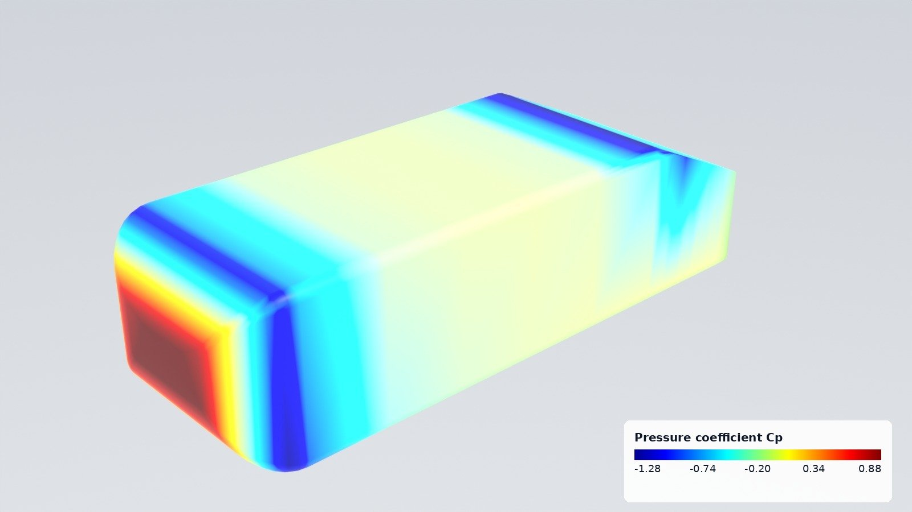
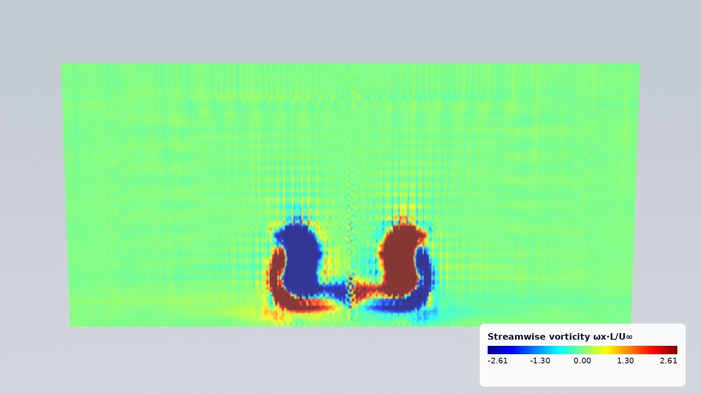
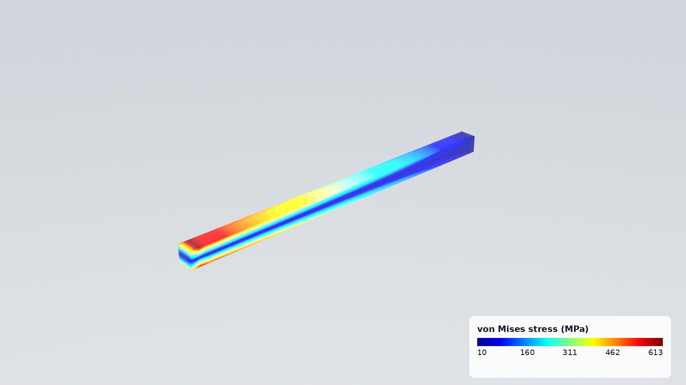
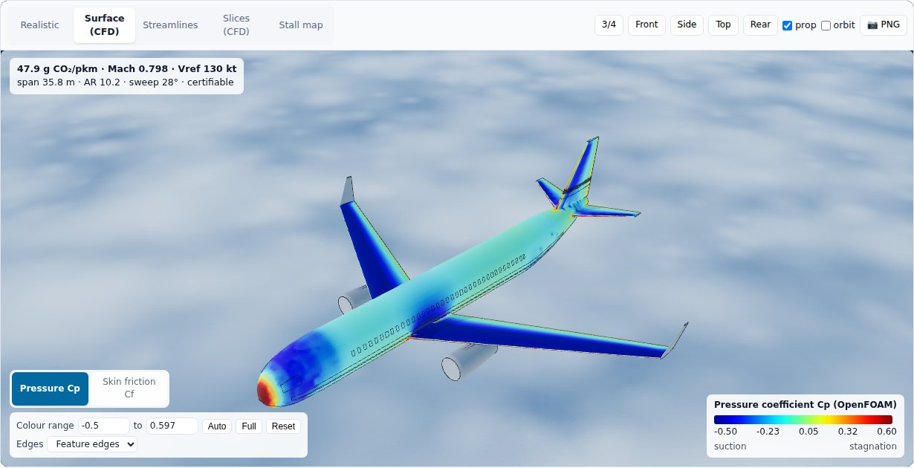

# 3D studio and external flow

Two layers turn any geometry and its physics into pictures people understand: `pp.viz`, which renders, exports and
browses, and `pp.cfd`, which runs OpenFOAM around any body. They came out of the Aircraft Design Optimizer
(`apps/aero_optimizer`) and work the same way for a car, a building, a heat sink or a beam.

```python
import pinneapple as pp

scene = pp.viz.Scene.from_file("result.frd")          # any result pinneapple_data.cae reads, or an STL/OBJ
scene.save("result.glb")                              # glTF with the fields; .usda for Omniverse; .stl
pp.viz.render(scene, "stress.jpg", field="STRESS")    # Blender Cycles, jet scale, colour bar
pp.viz.web_viewer(scene, "viewer/")                   # interactive page (python -m http.server -d viewer)
```





## Scene

A `Scene` holds surfaces (vertices, triangles, a material and per-vertex fields), polylines with values
(streamlines) and slice planes (a value grid on a rectangle, NaN where there is no fluid).

| Build it from | Call |
|---|---|
| STL (binary/ASCII, one surface per solid), OBJ | `Scene.from_file("part.stl")` |
| glTF/GLB (node transforms applied; float attributes `_NAME` become fields) | `Scene.from_file("model.glb")`, `axes="aircraft"` for files written in aircraft axes |
| VTK PolyData `.vtp` (needs `pip install vtk`) | `Scene.from_file("surface.vtp")`: point and cell data |
| OpenFOAM case or zip, CalculiX `.frd`, Abaqus `.inp`, Gmsh, VTK | `Scene.from_file(path)`: boundary surface with the cell or point fields; vectors become magnitudes, stress tensors von Mises |
| A `pinneapple_data.cae` mesh you already have | `Scene.from_mesh(mesh)` |
| Arrays | `Scene.from_arrays(vertices, faces)` |
| Parts of `pinneapple_design.aero` | `Scene.from_parts(parts)` (aircraft axes) |

Data known at other points (CFD wall faces, FEA nodes, sensors) goes onto the surface with
`scene.map_field("cp", points, values, mirror_y=True)`, using inverse distance over the nearest points. `mirror_y`
handles half models. `scene.labels["cp"] = "Pressure coefficient Cp"` sets the colour-bar title.

## Renders

`pp.viz.render(scene, out, field=..., lines=..., slice=..., view="iso", background="studio")` needs
`pip install bpy` (Blender as a Python module, CPU Cycles).

- **Field colours:** CFD colours use the jet scale, blue for low and red for high. The colour bar, with five ticks,
  is burnt into the image.
- **Views:** `iso`, `iso_back`, `iso_low`, `front`, `back`, `side`, `side_left`, `top` or `bottom`. The names assume
  x is the object's length (the flow direction) and z is up. A direction vector also works.
- **Backgrounds:** `background="studio"` gives a light gradient with true colours; `"sky"` gives a physical sky
  with filmic tone mapping, for the realistic materials.

## Browser viewer

`pp.viz.web_viewer(scene, folder)` writes `index.html`, `viewer.js`, `studio-core.js`, `scene.glb`, `scene.json` and
a copy of three.js, so no internet is needed. `pp.viz.serve(scene)` does the same in a temporary folder and serves it.
The page has these modes:
- **Realistic:** the materials;
- **one mode per field:** jet scale with a colour bar;
- **Streamlines:** coloured by their values;
- **one mode per slice group:** slices added with the same `group` form a stack.



Controls under the modes:
- **Colour range:** type the ends, or press *Auto* (1st to 99th percentile, the default) or *Full* (minimum to
  maximum). Each field, the lines and each slice group keep their own range.
- **Slice position:** a slider through the slices of a stack, for example the wake planes of `ExternalFlow`.
- **Line density:** shows an evenly spread share of the streamlines.
- **Edges:** off, feature edges (creases above 30°) or wireframe.

`studio-core.js` holds the colour scale, colour bar, tubes, slice textures and edges. The apps load it from
`/studio/studio-core.js` (the aircraft app's viewer is built on it), and its tick labels match the Python colour bar
of the renders. Its tests run with `node --test tests/js/studio_core.test.mjs`.

**How big a mesh?** Measured with a closed surface carrying two fields, in headless Chromium with software WebGL on 4
CPU cores. That is a worst case: a laptop GPU draws frames much faster, while loading and recolouring run on the CPU
anyway.

| Triangles | scene.glb | Export | Page load | First frame | Field switch |
|---|---|---|---|---|---|
| 25 k | 0.7 MB | < 0.1 s | 2.4 s | 0.5 s | 0.1 s |
| 130 k | 3.6 MB | 0.1 s | 1.9 s | 0.8 s | 0.3 s |
| 260 k | 7.3 MB | 0.1 s | 2.5 s | 0.9 s | 0.5 s |
| 520 k | 14.5 MB | 0.2 s | 2.3 s | 1.4 s | 0.8 s |
| 1.04 M | 29.1 MB | 0.5 s | 2.8 s | 2.0 s | 1.7 s |

The file grows by about 28 bytes per triangle, plus about 2 bytes per triangle for each extra field.
- **Up to about 500 k triangles:** stays interactive.
- **Above 1 M triangles** (`web_viewer(..., max_faces=1_000_000)`, the default): the page gets a decimated copy.
  The scene itself is not changed, and `max_faces=None` keeps every triangle.
- **For a smaller file:** call `scene.decimate(n)` yourself. It uses vertex clustering and averages the fields, so
  thin features below the cluster size can close up.

Slices are stored as JSON grids, about 7 bytes per value. Keep them to a few hundred cells a side.

## Particle process videos

Thousands of spheres coloured by a value inside glass or steel equipment that moves (an impeller turning), rendered
with Cycles point clouds, then composed with charts that draw themselves as time runs, a colour bar and a clock.
Any Lagrangian result works: DEM, stirred tanks, fluidised beds, hoppers, sprays.

```python
from pinneapple_simulation.numerical_solvers.particles import StirredTank, suspend
from pinneapple_tools.visualization.studio.particles import compose_video, render_particle_frames

tank = StirredTank(R=0.075, H=0.15)                                   # pitched-blade turbine, glass tank
res = suspend(tank, n=12000, d=3e-3, rho_p=1200.0, rpm=lambda t: min(400.0, 16.0 * t), t_end=30.0)
angle = ...                                                           # impeller angle per frame
pngs = render_particle_frames(res["frames"], 3e-3, "frames/", field_range=(0, 0.4),
                              equipment=lambda k: tank.surfaces(angle[k]))
compose_video(pngs, res["times"], "tank.gif", mp4=True, frame_dir="composed/",
              charts=[("Particles Top [%]", res["times"], 100 * res["top_fraction"]),
                      ("Stirrer Speed [RPM]", res["times"], res["rpm"])],
              colorbar=("Velocity Magnitude (m/s)", 0, 0.4))
```

`frames` is a list of dicts with `x` (n, 3) and a value per particle (`speed` or `value`). `equipment(k)` returns
the surfaces of frame k as (name, vertices, faces, material) with material "glass", "liquid", "steel" or "grey".
Surfaces keep their topology between frames, so only the vertices move. The MP4 goes through Blender's own encoder,
so no ffmpeg binary is needed. The lab experiment `particle_suspension` runs the whole chain with checks: settling
velocity against Schiller-Naumann, a divergence-free flow, particles kept in the tank, and the just-suspended speed
against Zwietering.

## Structural FEA with CalculiX: `pp.fea`

The same few lines for any part: a mesh, sets picked by geometry, one step, results as arrays, the post-processor
figure or a Blender render.

```python
import pinneapple as pp

m = pp.fea.FEModel.from_gmsh(pp.fea.geo_l_bracket(), size=0.0025)      # gmsh C3D10; or FEModel.from_box(...)
m.material = pp.fea.Material("steel", E=210e9, nu=0.3, density=7850.0)
base = m.nodes_where(lambda X: X[:, 2] < 1e-9)
top = m.nodes_where(lambda X: X[:, 2] > 0.08 - 1e-9)
res = pp.fea.solve(m, pp.fea.Static(fix=[(base, (1, 2, 3))], loads=[(top, (2000.0, 0, 0))]), "work/bracket")
res.u, res.stress, res.von_mises, res.reactions
modes = pp.fea.solve(m, pp.fea.Frequency(6, fix=[(base, (1, 2, 3))]), "work/modes")   # .frequencies, .modes

from pinneapple_simulation.numerical_solvers.solid_fem import fea_figure
fig, _ = fea_figure(res)                                                # deformed mesh, S Mises bands, legend
```

Steps: `Static` (point loads, face pressure, gravity, nonlinear geometry, plasticity through `Material.plastic`),
`Frequency`, `Buckle`, `Heat` (fixed temperatures, film convection, surface flux). Faces come from
`m.faces_where(pred)` on face centroids. `ccx` runs natively or in the bundled Docker image, and gmsh meshes
any `.geo` script, OpenCASCADE booleans included. The lab experiment `calculix_case` checks five studies against
closed-form references: a plate with a hole (Heywood), an L bracket (M c / I, mesh convergence), modes
(Euler-Bernoulli), buckling (Euler) and a fin (1-D fin).

## External flow: `pp.cfd.ExternalFlow`

```python
flow = pp.cfd.ExternalFlow({"ahmed": pp.bodies.ahmed_body(25)}, speed=40.0, ground=0.0, half_model=True,
                           resolution="medium")
res = flow.solve("cases/ahmed", procs=4)      # write, snappyHexMesh, simpleFoam, read
res.coefficients                              # CD, CL, CS, pressure/friction split, per body, newtons
scene = res.to_scene()                        # skin Cp and Cf, streamlines by |U|/U∞, mid-plane and wake slices
```

**Setup**
- Steady incompressible RANS: simpleFoam, k-ω SST, wall functions.
- Bodies: a dict of `(vertices, faces)`, an STL path or a `Scene`.
- The domain and background cells scale with the bodies' length. `resolution` sets the surface refinement levels:
  `coarse`, `medium` or `fine`.
- `alpha` and `beta` tilt the flow.
- `half_model` adds a symmetry plane at y = 0.
- `wake_planes` (default `(0.25, 0.5, 1.0, 1.5)` body lengths behind the bodies): the cross-flow slices, one stack
  per field in the viewer.
- `ground` adds a road (`True`: at the lowest point of the bodies; a number: its height), moving with the flow unless
  `ground_moving=False`.

**Results**
- Forces: pressure plus wall-function shear from the log law at the first cell.
- Coefficients use `ref_area`; the default is the frontal area of the bounding box.
- A `FlowResult` can be saved with `res.save("result.npz")`.

**Validation, Ahmed body, 25° slant, 40 m/s, half model, moving road**

| Mesh | Cells | CD | Time (2 cores) |
|---|---|---|---|
| coarse | 0.15 M | 0.321 | 4 min |
| medium | 0.20 M | 0.298 | 10 min |
| wind tunnel (Ahmed et al. 1984) | | ≈ 0.285 | |

Needs OpenFOAM (v1912 and later tested). Set `FOAM_BASHRC` if its bashrc is not at
`/usr/share/openfoam/etc/bashrc`. `pp.cfd.openfoam_available()` checks it. The aircraft case
(`pinneapple_design.aero.case3d`) is built on the same pieces: `write_flow_fields`, `snappy_dict`, `run_case` and
`CaseFields`, which provides wall forces, streamline tracing and plane sampling for any case.

## Bodies

`pp.bodies.ahmed_body(slant_deg)`, `sphere`, `cylinder` and `box` return closed, outward-facing triangle meshes in
metres, with x along the flow and z up.

## Examples

- `examples/studio/01_any_result_in_3d.py`: a CalculiX result as glTF, USD, viewer and render.
- `examples/studio/02_ahmed_body_cfd.py`: from geometry to pictures, through OpenFOAM.
- `examples/studio/03_airliner_with_cfd.py`: the aero app's airliner with its OpenFOAM skin pressure.
