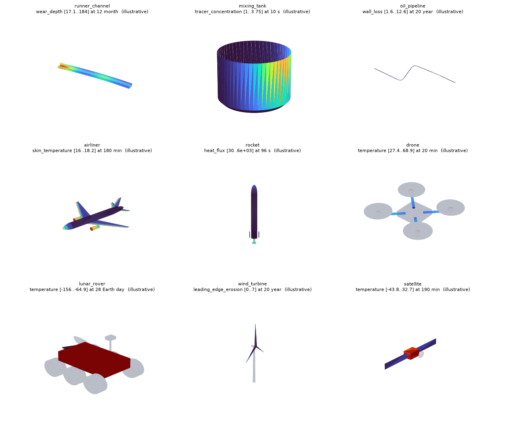

# Recreate a 3D wear twin (refractory, liner, pipe wall)

This guide shows how to rebuild, with PINNeAPPle, the kind of digital twin that monitors **wear of a lining
over time**: a 3D vessel coloured cell by cell, a remaining-life forecast, and a maintenance schedule that
comes out of an executable algorithm. It was written after reverse-engineering five published reference
twins (steel ladle, pig-iron ladle, BOF converter, RH degasser and the Oxy-Red reactor); all five are presets.

Everything lives in `pinneapple_twin3d.wear`; the 3D viewer is the one `pinneapple_twin3d` already ships.

## 1. What these twins actually are

Reading the published reference apps (single-file HTML + three.js) showed what is *real* in them, and it is
less and simpler than the visuals suggest:

| Piece | What it really is |
|---|---|
| Geometry | A **surface of revolution** per zone (wall, cone, floor, snorkel leg), cut into `rows x sectors` cells. |
| Data | Wear depth `[mm]` per cell and per reading `x` (heat number). One contract for every vessel. |
| Colour | The consumed fraction of the usable thickness, `wear / (e0 - emin)`, mapped to a colour ramp. |
| Forecast | **Linear least squares** of the residual thickness over the last ~30 heats of each cell; remaining life = `(residual - emin) / -slope`. Nothing more. |
| Process animation | Decoration (pours, jets, rotation). Not part of the wear model. |
| Demo data | A synthetic generator inside the app (hot spots × growth law). The embedded dataset was empty. |

What the originals do **not** contain: arrival-time (ETA) prediction, geographic maps, an optimizer. The optimizer
in this module is new, so it is documented as such (section 5).

So a "wear twin generator" needs only: a *spec*, a *dataset*, the *forecast*, an *optimizer*, and a *viewer*.

## 2. The five steps

```python
from pinneapple_twin3d import serve
from pinneapple_twin3d.wear import (HotSpot, VesselSpec, ZoneSpec, synthetic_campaign,
                                    forecast, optimize, export_wear_twin)
```

### Step 1 - Describe the part (`VesselSpec`)

A zone is a profile polyline `(r, y)` in metres, revolved around the vertical axis:

```python
wall  = ZoneSpec("wall",  "Wall",  ((1.2, 0.0), (1.2, 2.0)), n_rows=12, n_sectors=24, e0=200, emin=80, group="wall")
floor = ZoneSpec("floor", "Floor", ((0.0, 0.0), (1.2, 0.0)), n_rows=5,  n_sectors=24, e0=250, emin=100, group="floor")
spec  = VesselSpec("tank", "Cylindrical tank", (wall, floor), x_name="batch")
```

* wall / cone / neck: points along the hot face from bottom to top (a cone is just two points with different `r`);
* floor: `(0, y) -> (R, y)`; rows are rings; a dished floor is a polyline of an ellipse (see the BOF preset);
* off-axis parts (the RH snorkels): `center=(x, z)`, and `theta0` to orient sector 0;
* `e0` is the new thickness and `emin` the minimum allowed, both in mm. They drive the colour scale and the limit.

Row 0 is the first profile point; sector 0 starts at angle `theta0`, angles run counter-clockwise seen from
above. Use the same convention in your drawings so rows/sectors match the plant's brick numbering.

### Step 2 - Get a dataset (`WearDataset`)

* **Measured** (the real thing): a CSV `zona,fiada,setor,valor,corrida` (same columns as the reference apps) or
  the JSON contract. `WearDataset.from_csv(spec, text)` / `from_contract(spec, dict)`. Missing cells are `NaN`.
* **Synthetic** (before real data exists): `synthetic_campaign(spec, hotspots, ...)`. `HotSpot(zone, s, theta, ds,
  dtheta, amp)` places a Gaussian bump of extra wear at position `s` (0..1 along the profile) and angle `theta`
  (`None` = a band all around). Repairs can be simulated (`repairs=`, `repair_zones=`).

Synthetic data is labelled in the dataset (`origin="synthetic"`), in the viewer title and in the report. Do not
remove those labels: a demo that looks like plant data is a liability.

### Step 3 - Forecast (`forecast`)

```python
fc = forecast(ds)     # per zone: worst consumed fraction, remaining life (in x), wear rate, critical cell, confidence
```

Details that matter (all tested, and identical in the JavaScript core of the web suite):

* the fit window is `win_x=30` heats, widened to at least `min_pts=8` readings when readings are sparse;
* a **repair** (a drop of wear larger than 2 % of the usable thickness between readings) restarts the window,
  so gunning does not poison the slope;
* a cell already at the limit has remaining life `0` but its wear *rate* is still estimated, which the optimizer needs;
* flat or recovering cells give `inf` (no trend);
* `confidence` ("low/medium/high") grades the fit (points and R²). It is not a probability.
* `remaining_lo` / `remaining_hi` give a **90 % interval** from the standard error of the slope (Student-t, needs
  n >= 3), i.e. the ETA "in ~181 heats (150-230)". It measures the *fit*; it cannot cover a change of regime. With the
  3 readings of the Oxy-Red demo the interval is wide and the confidence "low", which is the honest answer.
* a >8 % dip between readings is read as a repair; at twice the default instrument noise ~1 % of cells are truncated
  by that heuristic (measured, see the tests). If your plant logs repairs, prefer passing them explicitly.
* it is a **linear extrapolation**: it cannot foresee a change of regime (a new slag, a changed blow practice).
  `backtest(ds)` compares past predictions with the heat where the limit was actually reached, when that happened.

### Step 4 - Optimize maintenance (`optimize`)

```python
res = optimize(fc, OptimizerConfig(horizon=300, heats_per_day=24))
res.recommended, res.baseline, explain(res)
```

Three policies are *simulated* over the horizon on the forecast: run to the limit (`reactive`), fixed calendar,
and `predictive` grouped stops (stop before the earliest deadline minus a safety margin, serve together the zones
whose deadline falls inside a grouping window, search the window). Cost = stops (setup + hours) + zones served +
a penalty per heat operated beyond the limit. The recommendation is the cheapest policy with **no breach**.

#### Calibrating the assumptions

The defaults are relative placeholders. `calibrate(stops, ds)` replaces what the plant's own records can support and
says so for each parameter:

```python
from pinneapple_twin3d.wear import StopRecord, calibrate
cal = calibrate([StopRecord(zones=['fundo', 'cone'], duration_h=11, cost=220), ...], ds)
cal.cfg        # an OptimizerConfig with the calibrated values
cal.report     # per parameter: value, source (calibrated | default | business input), n, standard error, note
```

| Parameter | Estimated from | Needs |
|---|---|---|
| `setup_hours`, `hours_per_zone` | `duration = setup + per_zone * n_zones` over the stop log | >= 3 stops, >= 2 different zone counts |
| `cost_per_hour`, `cost_per_zone` | `cost = c_h * duration + c_z * n_zones` | >= 4 stops with a cost |
| `recovery_frac` | median wear drop / usable thickness at the repairs detected in the dataset | >= 20 repaired cells |
| `breach_cost_per_x`, `safety_margin`, `horizon`, `heats_per_day`, `fixed_interval` | **never inferred**: business decisions | - |

A fit that gives a negative time or cost is rejected and the default kept. The web hub has the same panel
(upload a CSV `zonas,duracao_h,custo` or JSON) and the two implementations are parity-tested.

Be explicit about the three layers when you show it: **observed** (readings), **predicted** (forecast), **recommended**
(schedule). The report keeps them in separate sections. Costs are relative and every assumption is an
`OptimizerConfig` field. It is decision support: nothing is sent to equipment.

### Step 5 - Export and look (`export_wear_twin`)

```python
export_wear_twin(ds, "out/tank")     # scene.json, geometry.glb, fields.bin, viewer, wear_dataset.json, report.json
serve("out/tank")                    # http://localhost:8765/?field=consumed_fraction&step=last
```

The viewer's fields: `wear_depth`, `consumed_fraction`, `residual_thickness`, `remaining_life`. Use the clipping
plane to look at the hot face from inside. `wear_dataset.json` is the same contract the web hub reads, so the
twin can also live in the hub next to the others.

## 3. The four reference use cases

```python
from pinneapple_twin3d.wear import presets
spec, hotspots = presets.get("bof_converter")   # steel_ladle | pig_iron_ladle | bof_converter | rh_degasser
```

| Preset | Zones | What is special |
|---|---|---|
| `steel_ladle` | rim, slag line, metal wall, floor | conical shell; porous plugs and alloy-jet impact on the floor |
| `pig_iron_ladle` | rim/spout, slag line, metal wall, floor | slag-line height derived from the fill level (mass → level); torpedo-jet impact block; KR rotor vortex band |
| `bof_converter` | floor (dished), lower barrel, slag line, upper barrel, cone, mouth | arc-length-defined wall (barrel → cone → neck); tap-hole side of the cone |
| `rh_degasser` | lower/upper vessel, floor, up- and down-snorkel | **off-axis** legs; most wear at the immersed tip |
| `oxyred_reactor` | upper/lower shaft, tuyere zone, crucible wall, hearth | sector 0 = tap hole; eight tuyere hot spots between tap holes |

Geometry comes from the proportions published in the reference twins and is **indicative**. Replace the numbers
with the plant's drawings; nothing else changes. Run all four: `python examples/use_cases/refractory_wear_twin/run_use_cases.py`.

## 4. A new part in 25 lines

`examples/use_cases/refractory_wear_twin/custom_part.py` builds a cylindrical tank with a slag band and an impact
pad. The recipe for any other part: (1) list the surfaces of the hot face and write each as a profile; (2) choose
rows/sectors so a cell matches the unit you measure (a brick course × a sector); (3) set `e0`/`emin` per zone from
the lining design; (4) pick the real `x` (heats, days, tonnes); (5) test with synthetic data, then swap in the
measurements. Anything that is a surface of revolution fits (vessels, tanks, ladles, snorkels, straight pipe
sections). For shapes that are not (a pipe bend, a tundish with flat faces), build the mesh yourself and use
`Scene.add_trimesh` with per-vertex fields, as in `pinneapple_twin3d.demo`; the forecast and the optimizer
only need the dataset contract, not the geometry.

## 4b. Beyond liners: the gallery

Wear is only one use of the generator. `pinneapple_twin3d.primitives` (revolve, sweep along a path, loft of airfoil
sections, box, cylinder) and `pinneapple_twin3d.gallery` build complete 3D twins of very different parts, each with
time-varying fields and sensors:

```python
from pinneapple_twin3d import gallery
gallery.export_all("out/gallery")      # index.html + one folder per part
```

| Part | Built from | Illustrative fields |
|---|---|---|
| `runner_channel` (blast-furnace trough) | sweep of an open U along a curved path | wear at the metal/slag lines and under the tap jet, remaining thickness |
| `mixing_tank` | dished revolve, shaft, two pitched-blade impellers, baffles | tracer blending, impeller shear (spin-up) |
| `oil_pipeline` | filleted path, circular sweep | wall loss at bend extrados and the 6 o'clock line, pressure drop, UT probes |
| `airliner` | revolved fuselage, lofted swept wings, tail, nacelles | skin temperature through climb/cruise/descent, wing-root bending |
| `rocket` | ogive + stack, bell nozzle, fins | aero heating peaking mid-ascent at the nose, throat heat flux and ablation |
| `drone` | box, arm cylinders, motors, rotor discs | motor/arm/battery heating over a flight |
| `lunar_rover` | box chassis, six wheels, mast, dish | day/night chassis temperature, wheel wear that grows only when driving |
| `wind_turbine` | tapered tower, three twisted blades | leading-edge erosion at the tips, root fatigue |
| `satellite` | bus, two arrays, dish | thermal cycling through sunlight and eclipse |



*(rendered with `examples/use_cases/refractory_wear_twin/render_gallery_png.py`; the interactive viewer shows the same scenes with the time slider)*

**All gallery fields are illustrative** closed-form patterns that put the physics where an engineer expects it. They are
not simulation or measurement results, and every title and `source` says so. To use real fields, build the same scene
and call `Scene.add_field(part, name, values)` with your (T, V) arrays; the tests check that parts are valid meshes
and that the patterns behave (erosion at the bend, heating at the nose, front wheels wearing more, ...).

## 5. What is real, what is not

* **Real and tested**: the cell geometry, the dataset contract (validation, CSV, JSON), the forecast
  (parity-tested against the JavaScript core), the optimizer simulation, the four presets end to end, the exported
  scene (valid glTF, fields aligned to cells).
* **Synthetic**: every wear value produced by `synthetic_campaign`. It encodes where the process is known to
  attack the lining, not a physical model. The hot-spot amplitudes are illustrative.
* **New in this module, not in the reference twins**: the confidence grade, the ETA interval, the backtest, the
  optimizer and its calibration. The optimizer's cost *structure* is an assumption; its numbers must come from
  `calibrate` (stop log, history) and from business decisions (cost of a heat beyond the limit).
* **Out of scope**: process animation of each vessel, arrival-time prediction, geo maps, plant integration.

## 6. Checklist before showing a twin to someone

1. The viewer title says SYNTHETIC if the data is synthetic.
2. Colour scale: `consumed_fraction = 1` is the limit; cells above 1 are in breach.
3. `forecast` confidence is shown next to every remaining-life number.
4. The recommended schedule lists its assumptions and says it is decision support.
5. `pytest tests/test_twin3d_wear.py` passes.
