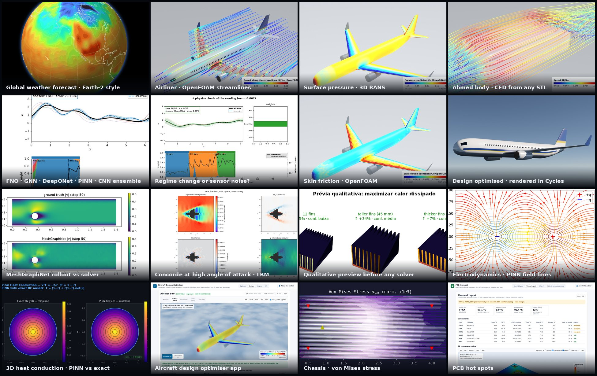
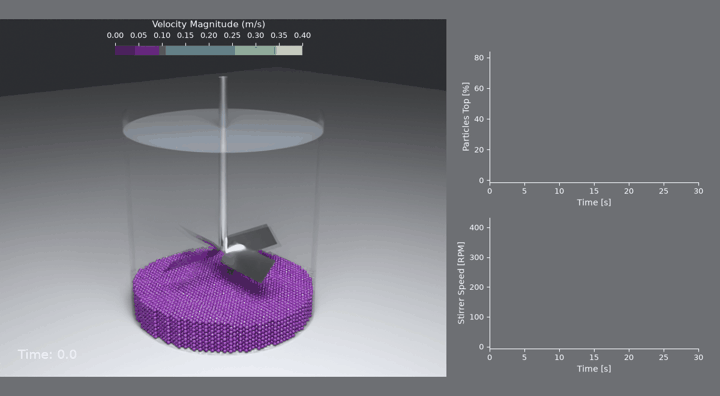
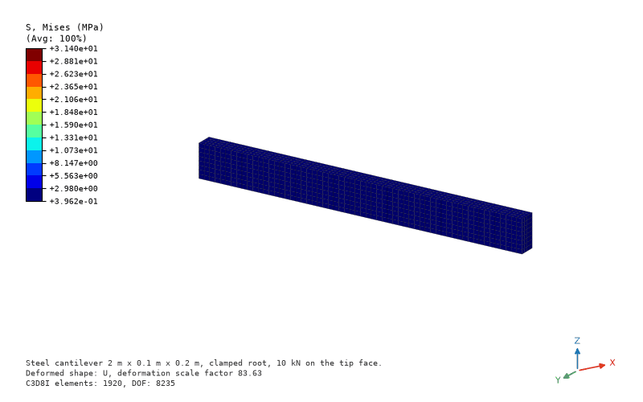
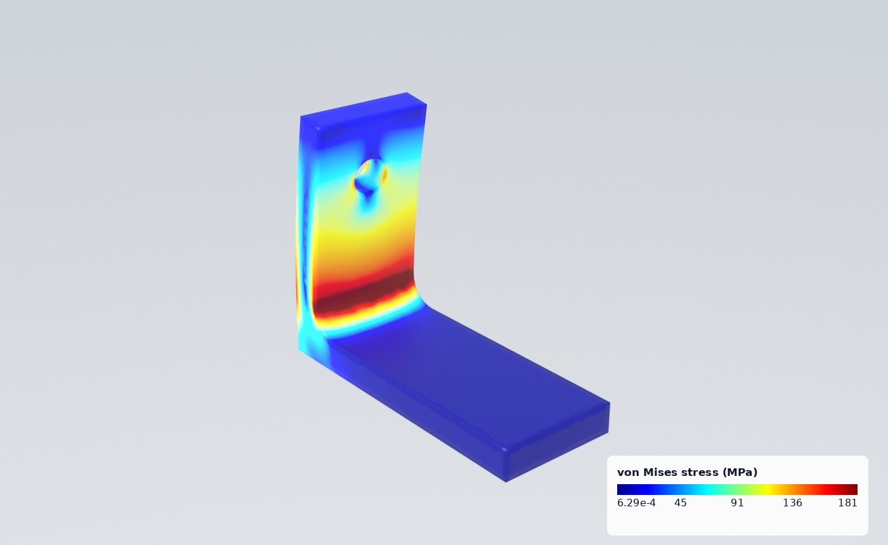
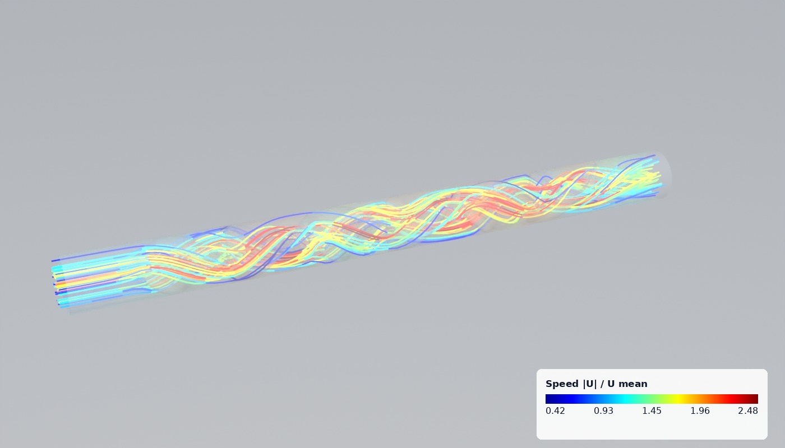
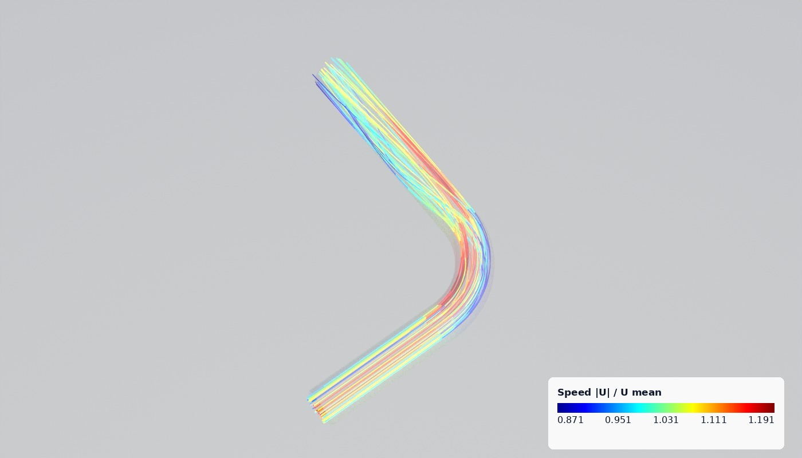
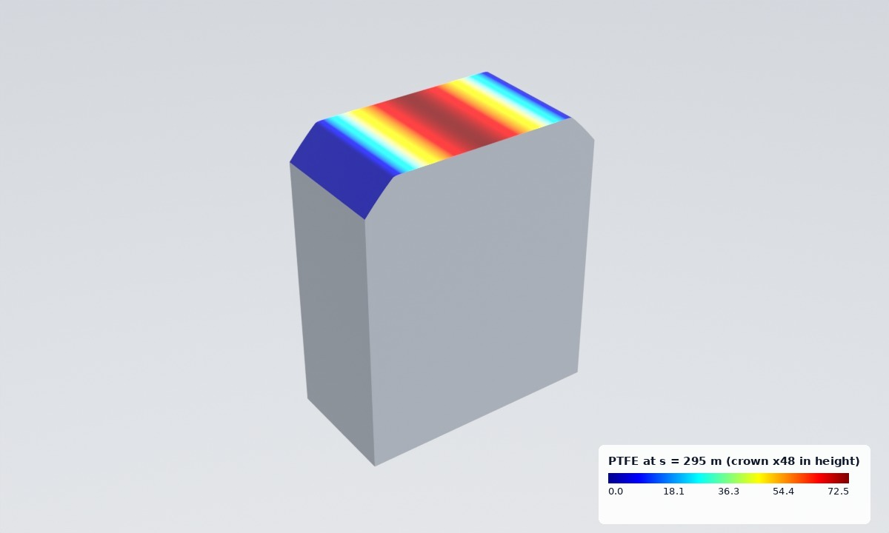
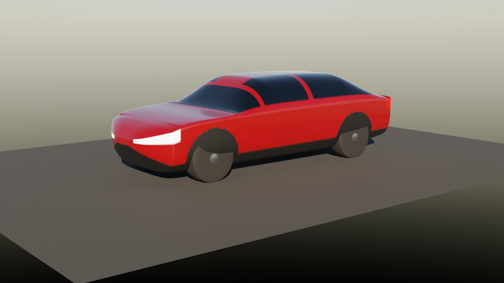
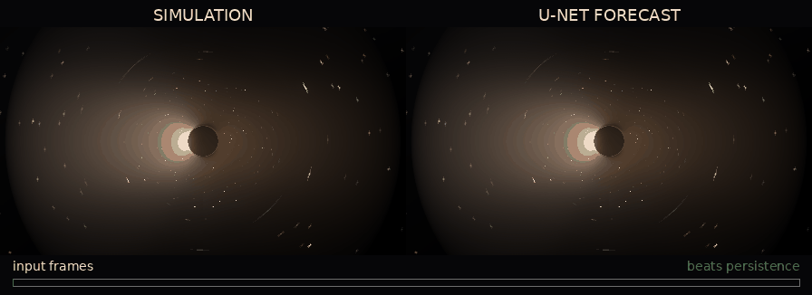

---
hide:
  - navigation
  - toc
---

# PINNeAPPle

**Physics AI that tells you when to trust it.** Solve, simulate, forecast and design with physics-informed AI, and
know for every result whether it still holds: checked against references, baselines and physical laws, with its
uncertainty and its limits written down.

[Get started](getting_started/installation.md){ .md-button .md-button--primary }
[Experiment catalogue](lab/index.html){ .md-button }
[GitHub](https://github.com/PINNeAPPle-Labs/PINNeAPPle){ .md-button }



## What it does

<div class="grid cards two" markdown>

-   **Simulate**

    ---

    OpenFOAM around any body or through pipes and mixers, CalculiX from Python (`pp.fea`), lattice Boltzmann,
    DEM particles, a 3-D finite-element solver, black-hole hydrodynamics. Each one verified on a case with a known
    answer.

-   **Learn**

    ---

    PINNs, FNO, DeepONet, MeshGraphNet and equivariant GNNs, reduced-order models (POD, DMD, Operator Inference,
    parametric POD-GPR), forecasters, all trained against their baselines.

-   **Trust**

    ---

    Every result answers six questions: data and geometry, model, physical constraints, benchmark, uncertainty and
    the engineering decision. The evidence is a passing check, never a claim.

-   **Show**

    ---

    Blender renders, post-processor style FEA figures, process videos with live charts, a browser 3-D viewer and
    glTF / USD exports, from the same results the checks ran on.

</div>

## From the experiment catalogue

<div class="gallery">
<figure><figcaption>Solids suspension in a stirred tank: 12 000 DEM particles, live charts</figcaption></figure>
<figure><figcaption>3-D FEA cantilever, von Mises in post-processor bands</figcaption></figure>
<figure><figcaption>L bracket in CalculiX, gmsh C3D10</figcaption></figure>
<figure><figcaption>Kenics static mixer: streamlines through six elements</figcaption></figure>
<figure><figcaption>90° pipe bend, k-ω SST, Dean vortices</figcaption></figure>
<figure><figcaption>Sliding wear of a bar end, coloured by wear depth</figcaption></figure>
<figure><figcaption>Road car in OpenFOAM, CD 0.288</figcaption></figure>
<figure><figcaption>Black-hole accretion forecast vs simulation</figcaption></figure>
</div>

| experiment | checked against | result |
|---|---|---|
| Solids suspension in a stirred tank (DEM) | Zwietering's just-suspended speed | 288 rpm, inside 237–474 rpm |
| Plate with a hole (CalculiX, gmsh C3D10) | Heywood's stress concentration | Kt 2.59 vs 2.51, GCI 1.7 % |
| Cantilever, 3-D FEA (C3D8I) | Timoshenko beam, CalculiX on the same mesh | 0.6 % deflection, 3e-6 vs CalculiX |
| 90° pipe bend, k-ω SST | Colebrook friction, Ito bend loss | 3.6 % and −15 % |
| Parametric beam ROM (POD-GPR) | nearest training design, 20 unseen designs | 0.4 % median error, 16 000× faster |
| Cylinder wake ROM (POD-DMD) | probe spectrum, persistence | Strouhal within 0.03 %, 3 % error over 3 periods |

Every experiment, with its figures, movies, checks, tier and trust card, is in the
**[experiment catalogue](lab/index.html)**.

## Five lines to a validated result

```python
import pinneapple as pp

m = pp.fea.FEModel.from_gmsh(pp.fea.geo_l_bracket(), size=0.0025)     # CAD-like geometry, gmsh C3D10
m.material = pp.fea.Material("steel", E=210e9, nu=0.3)
base, top = m.nodes_where(lambda X: X[:, 2] < 1e-9), m.nodes_where(lambda X: X[:, 2] > 0.08 - 1e-9)
res = pp.fea.solve(m, pp.fea.Static(fix=[(base, (1, 2, 3))], loads=[(top, (2000.0, 0, 0))]), "work/bracket")
print(res.von_mises.max() / 1e6, "MPa")
```

```bash
pip install pinneapple
python -m pinneapple_lab run calculix_case -p case=plate_hole     # run, check, store, and see it in the catalogue
```

## Where to go next

- **[Installation](getting_started/installation.md)** and the first PINN.
- **[The lab](core_concepts/lab.md)**: experiments, datasets, curation, the trust card and reports.
- **[3-D studio, CFD and FEA](core_concepts/studio.md)**: renders, OpenFOAM, CalculiX and particle videos.
- **[Reduced-order models](core_concepts/reduced_order_models.md)**: POD, DMD, Operator Inference, parametric ROMs.
- **[PINNeAPPle Labs](org/index.html)**: who we are, the trust card and the open repositories.
