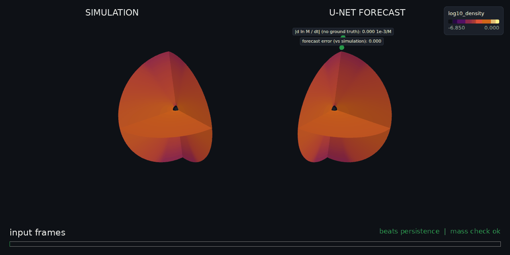
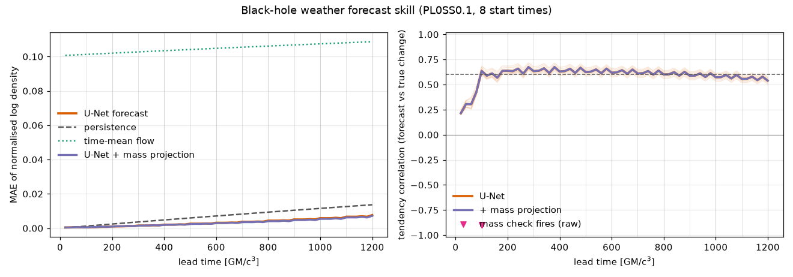
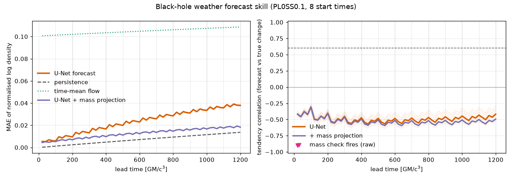

# Black-hole weather: forecasting the gas around a black hole, and knowing for how long to trust it

This is a reproduction and extension of **Duarte, Nemmen & Navarro (2022)**, *Black hole weather forecasting with deep learning: a pilot study*:
- MNRAS 512, 5848; [arXiv:2102.06242](https://arxiv.org/abs/2102.06242);
- original code (MIT): [black-hole-group/DL_BH_fluids](https://github.com/black-hole-group/DL_BH_fluids).

The work is tracked in issue [#399](https://github.com/PINNeAPPle-Labs/PINNeAPPle/issues/399). All credit for the idea and the architecture goes to the original authors. Mistakes in this port are ours.


*General-relativistic ray tracing of the simulated flow (left) and of the U-Net forecast (right).*
- Light bends around the hole, which gives the shadow, the photon ring, the lensed far side of the flow and the lensed stars.
- The gas moving towards us is Doppler-boosted.
- The bar compares the forecast error with doing nothing (persistence).



*The same forecast in the PINNeAPPle-Twin3D viewer: a 3/4 cutaway of the axisymmetric flow, with the forecast-error and mass-check sensors.*

## What was done

| step | how | where |
|---|---|---|
| simulations | Four 2.5-D viscous hydro runs of a torus accreting onto a Schwarzschild hole: Paczyński-Wiita potential, α-viscosity, 128 × 64 cells, r = 4-400 GM/c², 10⁴ GM/c³ each, frames every 10 GM/c³. The paper's PLUTO data are on Figshare, which this environment cannot reach, so the flows were regenerated with the library's own solver. | `simulate.py`, `pinneapple_physics.blackhole.hydro` |
| solver checks | Mass and angular momentum conserved to 10⁻¹⁶; exact Bondi accretion steady within 0.5 % (accretion rate); the inviscid torus holds its equilibrium. | `tests/test_blackhole_weather.py` |
| forecaster | The paper's U-Net, ported layer for layer (5×5 convolutions, LeakyReLU 0.3, 5 frames in and 5 out, log-density normalisation, crop, the paper's loss). Filters 16 instead of 32 to fit a 4-core CPU. | `train_forecaster.py`, `pinneapple_physics.blackhole.forecast` |
| PINNeAPPle additions | A **residual** variant that predicts the change from the last frame; lead-time scores against persistence and the time-mean flow; a **tendency correlation** (forecast change against true change); a **mass check** that needs no truth, plus a projection onto that budget; a 3D twin and a GR-ray-traced view. | `evaluate.py` |

Runs are named like the paper's: `PL{a}{SS|ST}{α}`.
- Training uses `PL0SS0.1` with the paper's one-simulation split in time (70 / 10 / 20).
- `PL0SS0.3` (α = 0.3, never seen) is the out-of-distribution test, as the paper withholds PL0SS3.

## Results

Frames are 20 GM/c³ apart, so one 5-frame prediction covers 100 GM/c³. There are 8 rollouts of 12 blocks (1200 GM/c³) from different start times in the test segment. The error is the MAE of the normalised log density.

| model | test | error at +100 M | error at +1200 M | persistence at +1200 M | beats persistence up to | tendency corr. (blocks 2-12) | mass check first fires |
|---|---|---|---|---|---|---|---|
| U-Net as in the paper | PL0SS0.1, last 20 % | 0.0059 | 0.038 | 0.0137 | never | −0.50 | +20 M (every rollout) |
| **residual U-Net** | PL0SS0.1, last 20 % | **0.0005** | **0.0076** | 0.0137 | **≥ 1200 M** (whole rollout) | **0.61** | +100 M |
| U-Net as in the paper | PL0SS0.3 (unseen α) | 0.0072 | 0.025 | 0.0193 | never | −0.39 | +20 M |
| **residual U-Net** | PL0SS0.3 (unseen α) | **0.0011** | **0.0153** | 0.0193 | **≥ 1200 M** | 0.36 | none / +1200 M |

What this says, without spin:

- **The faithful port does not beat persistence here.** Our frames are 20 GM/c³ apart, where the flow changes far less from frame to frame than the network's error. Its predicted changes are even anti-correlated with the true ones. The paper used frames 198 GM/c³ apart, from PLUTO runs at about twice our resolution, so this is not a contradiction of the paper. It does show that the absolute-frame formulation needs large frame steps.
- **The mass check catches the faithful port at the first frame.** The window loses or gains 4-6 % of its gas per frame in the forecast, against 0.36 % in the simulation. After 1200 GM/c³ it holds half the gas it should. This is the "artificial mass injection" that the original authors identify as the source of drift, and here it is flagged with no ground truth.
- **Predicting the change fixes most of it.** The residual U-Net beats persistence at every lead of the 1200 GM/c³ rollout: 45 % lower error at the end in distribution and 21 % lower out of distribution. Its changes correlate with the true ones (0.61; 0.36 out of distribution). The test segment limits the rollout to 1200 GM/c³, so the true horizon is at least that.
- **Out of distribution, skill drops but survives.** With α = 0.3 the flow evolves about three times faster. Error and tendency correlation degrade, which is the cue the trust layer should act on.
- Projecting onto the training mass budget barely changes the error: mass errors are small next to the shape errors. It stays as a guard-rail.





Per-model summaries (scores by lead, horizons, mass checks) are in `results/`.

## Reproduce (4 CPU cores: about 1.5 h of simulation and 15 min of training)

```bash
python examples/black_hole_weather/simulate.py --out data/bh --name PL0SS0.1 --alpha 0.1 --viscosity SS
python examples/black_hole_weather/simulate.py --out data/bh --name PL0SS0.3 --alpha 0.3 --viscosity SS
python examples/black_hole_weather/train_forecaster.py --runs data/bh --train PL0SS0.1 --out runs/bh_res \
    --filters 16 --residual
python examples/black_hole_weather/evaluate.py --runs data/bh --model runs/bh_res --test PL0SS0.1 \
    --out runs/bh_res/eval --mass-projection --twin --interstellar
```

The trained residual model is in `checkpoints/residual_unet_f16_PL0SS0.1_fp16.pt` (load it with `pinneapple_physics.blackhole.forecast.load_forecaster`).

## Notes and limits

- The flows are 2.5-D hydrodynamics at 128 × 64. They are smoother (less turbulent) than the paper's runs, and much smoother than MHD.
- The ray-traced view uses the simulated density of each frame. Temperature and velocity are the time-mean of the simulation, because the forecaster predicts density only.
- The emissivity is ρ² √T and the disc is optically thin. The image is a physically motivated visualisation, not a radiative-transfer calculation.
- Next steps (#399):
  - frames at the paper's spacing;
  - the multi-simulation set-up;
  - forecasting all fields, which gives exact conservation residuals;
  - MHD;
  - longer test segments to find where the horizon actually ends.
