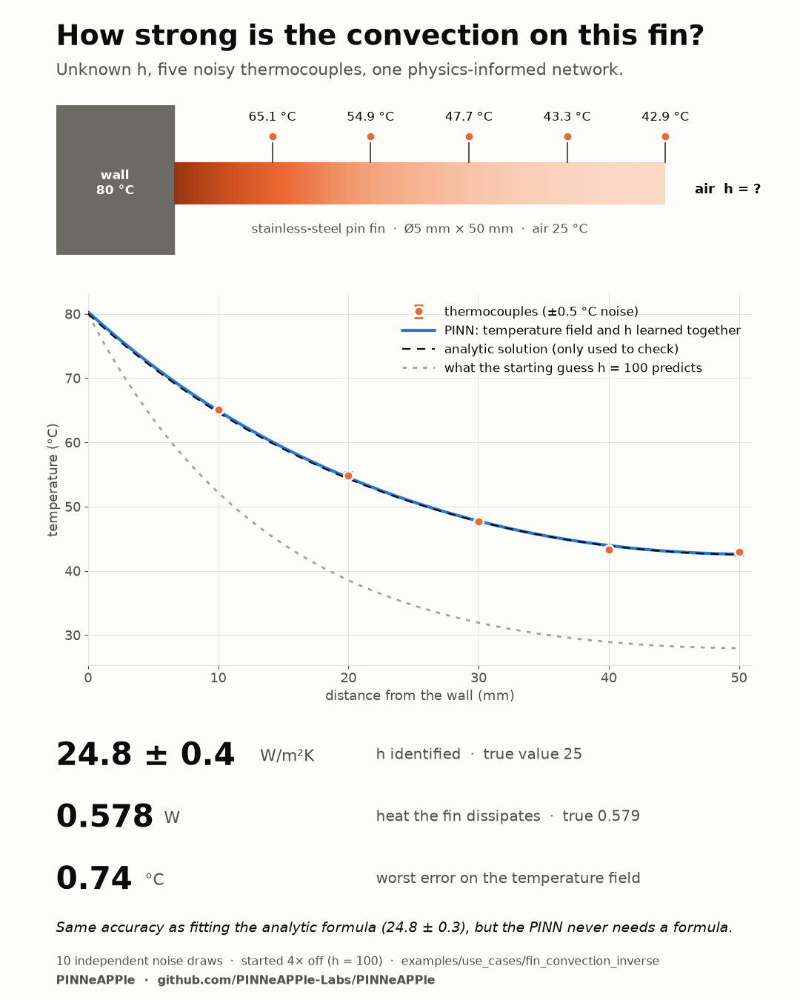
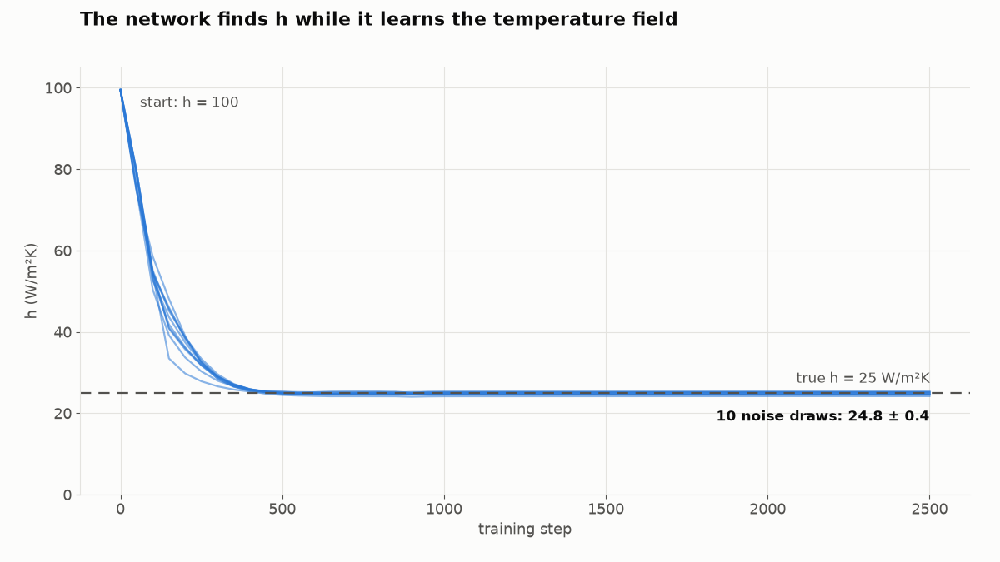
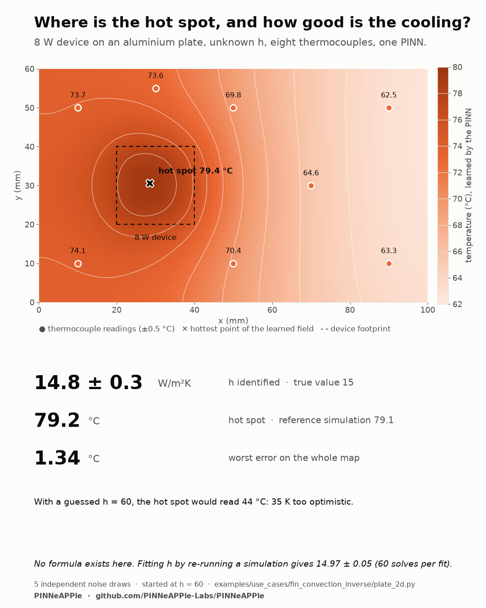
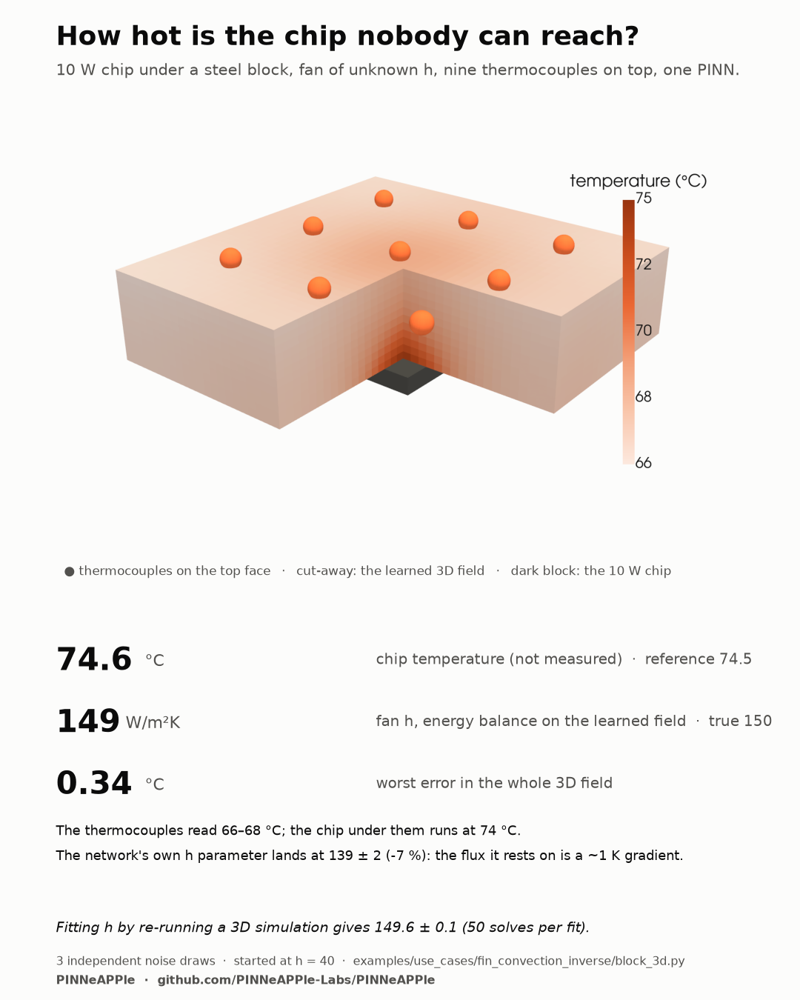

# Convection coefficient from a few thermocouples: 1D fin, 2D plate, 3D block (inverse PINN)

**Question.** A pin fin sits on an 80 °C wall in 25 °C air. How strong is the convection, i.e. what is the heat transfer
coefficient *h*? Textbook correlations for a real installation (obstructions, nearby walls, a fan somewhere) can easily be
off by 20–30 %, and *h* drives the heat the fin removes.

**Data.** Five thermocouples along the fin, ±0.5 °C noise. Nothing else.

**Method.** A physics-informed neural network (PINNeAPPle `PINNFactory`, symbolic residuals compiled to PyTorch)
learns the temperature field *T(x)* and *h* together. The loss holds the fin equation, the base temperature, the
convective tip condition (where *h* appears too) and the five readings; *h* is a trainable scalar that starts 4× off
(100 W/m²K). The network never sees the answer.

```
θ'' − m² θ = 0,   m² = 4h/(kD),   θ = (T − T∞)/(T_b − T∞)
θ(0) = 1                        base at 80 °C
−k θ'(L) = h θ(L)               convective tip
```



## Results (10 independent noise draws, `results/summary.json`)

Stainless-steel pin fin, k = 16 W/m·K, Ø 5 mm × 50 mm, true h = 25 W/m²K (used only to generate the readings).

| Quantity | PINN | Check |
|---|---|---|
| h (W/m²K) | **24.8 ± 0.4** (24.2 to 25.3) | true 25.0 |
| Heat dissipated, Q = −kA dT/dx at the base (W) | **0.578 ± 0.005** | analytic 0.579 |
| Worst error on the temperature field, all draws (°C) | **0.74** | thermocouple noise is 0.5 |
| h by least-squares fit of the analytic profile (W/m²K) | 24.8 ± 0.3 | needs the formula |

The PINN is as accurate as fitting the textbook formula to the same readings, which is the best one can do with this
data, but it does not need a formula: change the geometry, add a heat source or make it 2D and the same script
applies, where no closed form exists. The fin was chosen because it has one, so every number above can be checked.




## 2D: heat-spreader plate (`plate_2d.py`)

An aluminium plate (100 × 60 × 1 mm) carries an 8 W device (20 × 20 mm) and cools by natural convection from both faces;
h is unknown. Eight thermocouples (±0.5 °C). There is no formula for this field: the PINN learns T(x, y) and h from
`k t ∇²T − 2h (T − T_air) + q'' = 0`, the adiabatic edges and the readings. The check is an independent finite-volume
solution (`fv_reference.py`, 200 × 120 cells, grid-converged to 0.01 K).



| Quantity (5 noise draws) | PINN | Check |
|---|---|---|
| h (W/m²K) | **14.8 ± 0.3** | true 15 |
| Hot spot (°C) | **79.2 ± 0.2** | reference 79.1 |
| Worst temperature error on the map (°C) | **1.34** | |
| h by re-running the finite-volume model until it matches the readings | 14.97 ± 0.05 | 60 solves per fit |

With the starting guess h = 60 the hot spot would be predicted at 44 °C, 35 K too optimistic.

## 3D: chip under a steel block (`block_3d.py`)

A 10 W chip (10 × 10 mm) under a carbon-steel block (40 × 40 × 10 mm), fan-cooled top with an unknown h, nine
thermocouples on the top face. The bottom, where the chip is, cannot be reached. The PINN learns T(x, y, z) and h from
Laplace's equation, the chip flux, the convective top and the readings; the four adiabatic sides are built into the
network (inputs cos πx, cos πy), and a short L-BFGS polish follows Adam.



| Quantity (3 noise draws) | PINN | Check |
|---|---|---|
| Chip temperature, not measured (°C) | **74.6** | reference 74.5 |
| Worst temperature error in the 3D field (°C) | **0.34** | |
| h from the energy balance on the learned field (W/m²K) | **149.5** | true 150 |
| h, the network's own trainable parameter (W/m²K) | 139.4 ± 1.5 | -7 % |
| h by re-running the 3D finite-volume model | 149.6 ± 0.1 | 50 solves per fit |

Why the trainable h is low while everything else is right: in this block the flux that pins h is a ~1 K temperature
difference across 10 mm of steel, so a small error in the learned field is a large error on that gradient. Energy
conservation sidesteps it: all 10 W leave through the top, so h = P / ∫(T − T_air) dA on the learned top temperature,
which the readings pin down well. The chip temperature, the number a designer needs, does not depend on that choice.

## Run

```bash
python examples/use_cases/fin_convection_inverse/fin_convection_inverse.py   # about 5 minutes on a laptop CPU
python examples/use_cases/fin_convection_inverse/plots.py                    # figures again from summary.json
python examples/use_cases/fin_convection_inverse/plate_2d.py                 # 2D, about 20 minutes
python examples/use_cases/fin_convection_inverse/block_3d.py                 # 3D, about 30 minutes
python examples/use_cases/fin_convection_inverse/plots_2d3d.py               # 2D/3D figures (3D render needs pyvista)
```

## What to change for your case

* `K, D, L, T_BASE, T_AIR` and `SENSORS_MM`: your fin and where the thermocouples are; `t_meas` are your readings.
* `NOISE_C`: your sensor accuracy (it only matters for the synthetic readings and the error bars).
* For a fin without an analytic solution, keep `identify()` and drop `theta_exact`, `q_exact` and the least-squares
  reference, which are here only to check the result.

Limitations of the 1D case: steady state, one-dimensional conduction (Biot number of the fin cross-section ≪ 1), uniform h along the
fin, and synthetic readings generated from the same model the PINN uses. Real measurements add model error
(radiation, h varying along the fin, thermocouple contact), which this example does not include.
