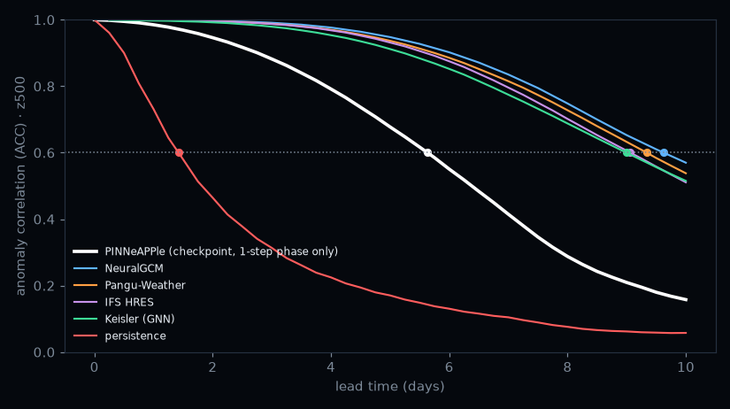

# Weather forecasting on ERA5: how many days a model is good for, and extreme events

A global forecast model trained with `pinneapple_physics.weather` on ERA5 (WeatherBench2, public, no account), scored
by lead time against persistence, climatology and the published IFS HRES, Pangu-Weather, Keisler and NeuralGCM
forecasts on the same 2020 cases, with the useful horizon (ACC >= 0.6) and the no-skill horizon (RMSE reaches
climatology), a per-forecast horizon from an ensemble, and seven extreme events forecast against what happened.

**Status: the experiment is half way.** Phase 1 of training (6-hour steps, about 2 h on 4 CPU cores) is done and its
weights are in `checkpoints/phase1_step15000_fp16.pt`; the rollout phases (2, 4 and 8 steps), which carry the skill
beyond 3-5 days, have not run (the cloud session that trained it is recycled when idle). Preview with the phase-1
weights, 21 forecasts of 2020:

| model | z500 RMSE day 3 | day 5 | useful (ACC >= 0.6) |
|---|---|---|---|
| PINNeAPPle, phase 1 only | 397 | 673 | 5.6 days |
| IFS HRES / Pangu / NeuralGCM | 104-125 | 251-288 | 9.1-9.6 days |
| persistence | 923 | 1017 | 1.4 days |




## Resume the experiment (a machine that stays on: 4+ cores, 16 GB RAM, 10 GB disk)

```bash
pip install -e . gcsfs
# 1. ERA5 1990-2022 on the 64 x 32 grid + climatology (about 35 min, 5 GB)
python -c "from pinneapple_physics.weather.data import download, Era5Store, climatology; \
download('wx/era5', (1990, 2022)); climatology(Era5Store('wx/era5'))"
# 2. the remaining training phases from the phase-1 weights (resumable: rerun the same command after a stop)
python -c "from pinneapple_physics.weather.train import train; \
train('wx/era5', 'wx/run2', hours=4.5, schedule=((1, 0.2), (2, 0.27), (4, 0.27), (8, 0.26)), lr=4e-4, \
init_from='examples/weather_forecasting/checkpoints/phase1_step15000_fp16.pt')"
# 3. scores, horizons, ensemble, events and GIFs (the 2020 baseline scores and the 2024 RS flood states are in data/)
python examples/weather_forecasting/run_use_cases.py wx/era5 wx/run2/model.pt wx/results
```

`train` writes `run2/last.pt` every 200 steps and continues from it when restarted. On a CPU with AMX/AVX-512 bf16
it uses mixed precision (about 27 samples/s on 4 cores); a GPU is not needed but makes it much faster.

## Files

- `score_baselines.py`: scores of persistence, climatology and the published models on 2020 (already in
  `data/baselines_2020.json`).
- `run_use_cases.py`: skill figures, `horizon.json` (useful and no-skill horizons per variable, per-forecast horizon
  from the ensemble checked against the real one), one GIF per event and `events.json` (days ahead each event was
  well forecast, next to IFS HRES and Pangu-Weather).
- `data/rs_floods_2024_40.npy`: ERA5 states of the 2024 Rio Grande do Sul floods (ARCO, 0.25 degree averaged onto
  the grid; float16), so the slow download is not repeated.

## Data and attribution

ERA5 reanalysis (Hersbach et al., 2020) from the Copernicus Climate Change Service (C3S), read through WeatherBench2
(Rasp et al., 2024) and the ARCO-ERA5 bucket of Google Research. Contains modified Copernicus Climate Change Service
information; neither the European Commission nor ECMWF is responsible for any use of it. The published forecasts
(IFS HRES, Pangu-Weather, Keisler, NeuralGCM) are read from WeatherBench2; only their scores are stored here.
Coastlines: Natural Earth (public domain).
