# PINNeAPPle Lab catalogue

138 runs, generated 2026-10-10 19:08.

| experiment | runs | completed | failed validation | failed | datasets (samples) |
|---|---|---|---|---|---|
| [accretion_flow](#accretion_flow) | 6 | 6 | 0 | 0 | frames (186) |
| [benchmark_case](#benchmark_case) | 7 | 7 | 0 | 0 | arrays (84), sweep (8), lead_skill (5) |
| [bondi_accretion](#bondi_accretion) | 6 | 6 | 0 | 0 | profiles (6) |
| [car_lbm](#car_lbm) | 12 | 10 | 1 | 0 | flow (11), vorticity (528) |
| [cylinder_lbm](#cylinder_lbm) | 9 | 7 | 2 | 0 | vorticity (720) |
| [example_script](#example_script) | 12 | 6 | 0 | 3 | - |
| [heat_xtfc](#heat_xtfc) | 12 | 8 | 4 | 0 | fields (12) |
| [kepler_law](#kepler_law) | 1 | 1 | 0 | 0 | orbits (19) |
| [lorenz_discovery](#lorenz_discovery) | 1 | 1 | 0 | 0 | - |
| [oscillator](#oscillator) | 60 | 60 | 0 | 0 | trajectories (60) |
| [oscillator_discovery](#oscillator_discovery) | 1 | 1 | 0 | 0 | discovered_laws (20) |
| [pendulum_video](#pendulum_video) | 1 | 1 | 0 | 0 | pendulum (1) |
| [repo_results](#repo_results) | 9 | 9 | 0 | 0 | strouhal (3), test_points (120), polar (5), temperature_fields_2d (5), rollout_scores (2), temperature_fields_3d (3), lead_time_skill (4), fields (1), held_out_error (3) |
| [vehicle_cfd](#vehicle_cfd) | 1 | 0 | 0 | 0 | - |

## accretion_flow

A hot torus accreting onto a Schwarzschild black hole (viscous 2.5-D hydro): density movie, accretion rate and mass / angular-momentum budgets. Frames form a dataset for forecasting.

| run | status | alpha | backend | every | nr | ntheta | seed | t_end | torus_a | viscosity | angmom_budget_error | capped_cells_last_step | frames | mass_budget_error | mdot_final | mdot_mean | checks |
|---|---|---|---|---|---|---|---|---|---|---|---|---|---|---|---|---|---|
| [d611a6352627](runs/accretion_flow/accretion_flow-d611a6352627) | completed | 0.05 | numba | 20.0 | 64 | 32 | 0 | 600.0 | 0.0 | SS | 6.086e-06 | 39 | 31 | 8.263e-16 | 12 | 5.965 | 3/3 |
| [2b4c5b53625d](runs/accretion_flow/accretion_flow-2b4c5b53625d) | completed | 0.05 | numba | 20.0 | 64 | 32 | 0 | 600.0 | 0.0 | ST | 1.407e-06 | 41 | 31 | 4.131e-16 | 7.284 | 3.834 | 3/3 |
| [2e487e9f3b08](runs/accretion_flow/accretion_flow-2e487e9f3b08) | completed | 0.1 | numba | 20.0 | 64 | 32 | 0 | 600.0 | 0.0 | SS | 6.517e-06 | 30 | 31 | 0 | 17.06 | 13.6 | 3/3 |
| [9ee81c81f58c](runs/accretion_flow/accretion_flow-9ee81c81f58c) | completed | 0.1 | numba | 20.0 | 64 | 32 | 0 | 600.0 | 0.0 | ST | 2.104e-06 | 38 | 31 | 0 | 11.75 | 8.522 | 3/3 |
| [4a0c1426e768](runs/accretion_flow/accretion_flow-4a0c1426e768) | completed | 0.2 | numba | 20.0 | 64 | 32 | 0 | 600.0 | 0.0 | SS | 3.978e-06 | 12 | 31 | 3.03e-11 | 19.49 | 23.11 | 3/3 |
| [069c9c145e88](runs/accretion_flow/accretion_flow-069c9c145e88) | completed | 0.2 | numba | 20.0 | 64 | 32 | 0 | 600.0 | 0.0 | ST | 7.946e-07 | 24 | 31 | 1.446e-15 | 16.15 | 15.31 | 3/3 |

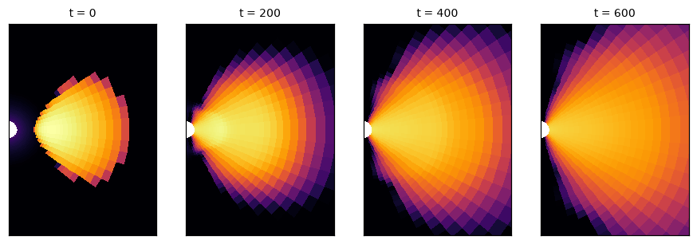

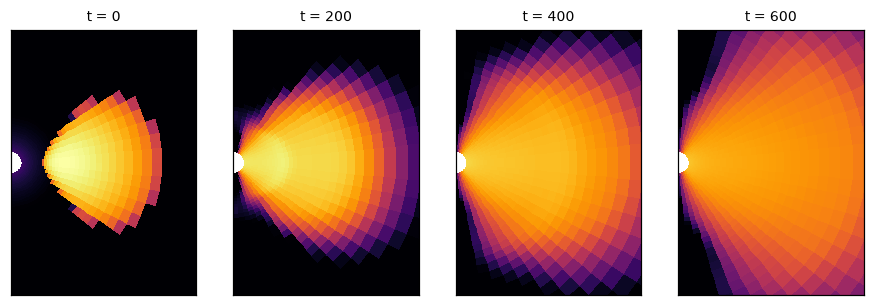

## benchmark_case

Cases from the PINNeAPPle Labs landing page that live in the public PINNeAPPle-Benchmark and PINNeAPPle-Climate repositories, imported with their headline claim re-checked, figures, the arrays behind the paper's figures and the source that produced them.

| run | status | case | Climatology|rmse_lead7_degC | Conv autoencoder + latent MLP|test_same_family|T_rel_l2 | Conv autoencoder + latent MLP|test_unseen_sinusoid|T_rel_l2 | Damped persistence (AR1)|rmse_lead7_degC | DeepONet (PINNeAPPle)|test_same_family|T_rel_l2 | DeepONet (PINNeAPPle)|test_unseen_sinusoid|T_rel_l2 | checks |
|---|---|---|---|---|---|---|---|---|---|
| [2814207947c8](runs/benchmark_case/benchmark_case-2814207947c8) | completed | soil_twin |  |  |  |  |  |  | 2/2 |
| [2a494685fed3](runs/benchmark_case/benchmark_case-2a494685fed3) | completed | bumper_crash |  |  |  |  |  |  | 2/2 |
| [e5981ba8bbc9](runs/benchmark_case/benchmark_case-e5981ba8bbc9) | completed | terramechanics |  |  |  |  |  |  | 2/2 |
| [b5fa8d70f3f9](runs/benchmark_case/benchmark_case-b5fa8d70f3f9) | completed | heated_channel |  | 0.09345 | 0.1409 |  | 0.8398 | 0.8314 | 2/2 |
| [b8f46b4fe34f](runs/benchmark_case/benchmark_case-b8f46b4fe34f) | completed | pdr |  |  |  |  |  |  | 2/2 |
| [3074f671a9d8](runs/benchmark_case/benchmark_case-3074f671a9d8) | completed | sst | 1.574 |  |  | 1.018 |  |  | 1/1 |
| [9cf13dffb830](runs/benchmark_case/benchmark_case-9cf13dffb830) | completed | shock_train |  |  |  |  |  |  | 2/2 |

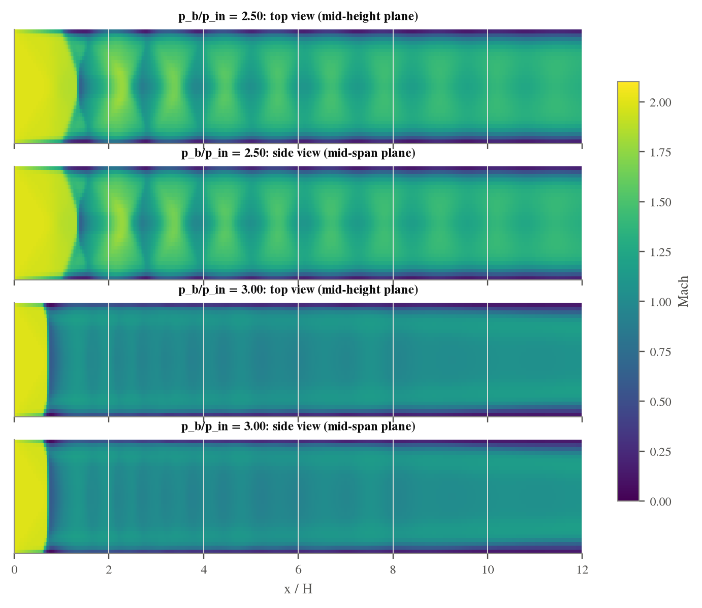

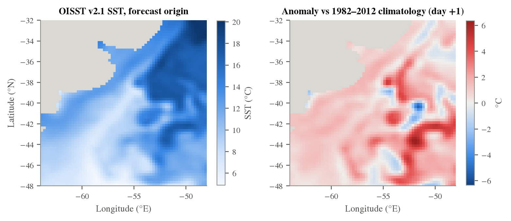

## bondi_accretion

Spherical accretion onto a Schwarzschild black hole (Paczynski-Wiita potential): the hydro solver started from the exact transonic Bondi solution must keep it steady.

| run | status | backend | cs_inf | gamma | nr | t_end | density_rel_error_max | density_rel_error_median | mdot_rel_error | sonic_radius | checks |
|---|---|---|---|---|---|---|---|---|---|---|---|
| [2606e5a668d9](runs/bondi_accretion/bondi_accretion-2606e5a668d9) | completed | numba | 0.08 | 1.3 | 64 | 300.0 | 0.06416 | 0.0004116 | 0.006652 | 48.81 | 2/2 |
| [b2e48df5c514](runs/bondi_accretion/bondi_accretion-b2e48df5c514) | completed | numba | 0.08 | 1.4 | 64 | 300.0 | 0.04122 | 0.0002985 | 0.007202 | 38.4 | 2/2 |
| [74ab4e4f9274](runs/bondi_accretion/bondi_accretion-74ab4e4f9274) | completed | numba | 0.1 | 1.3 | 64 | 300.0 | 0.04508 | 0.0005541 | 0.007008 | 33.19 | 2/2 |
| [3a8c3789e109](runs/bondi_accretion/bondi_accretion-3a8c3789e109) | completed | numba | 0.1 | 1.4 | 64 | 300.0 | 0.02593 | 0.0004488 | 0.007716 | 26.83 | 2/2 |
| [24fd3dba0cb6](runs/bondi_accretion/bondi_accretion-24fd3dba0cb6) | completed | numba | 0.14 | 1.3 | 64 | 300.0 | 0.02397 | 0.0009125 | 0.007964 | 19.4 | 2/2 |
| [42fdab9aa232](runs/bondi_accretion/bondi_accretion-42fdab9aa232) | completed | numba | 0.14 | 1.4 | 64 | 300.0 | 0.02302 | 0.0007038 | 0.008969 | 16.44 | 2/2 |

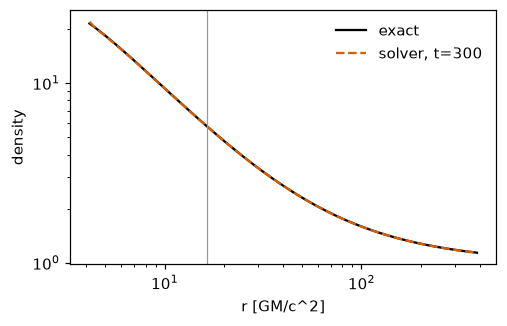

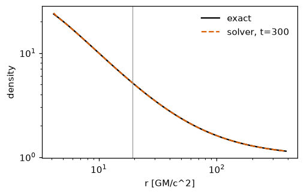

## car_lbm

Virtual wind tunnel for a parametric 2-D car body (Ahmed-type, six design parameters): lattice-Boltzmann LES with moving road; drag and lift by momentum exchange, mean flow, wake vorticity movie. The training data of car_surrogate.

| run | status | Cs | Re | clearance | diffuser_deg | hood | length_cells | nose | slant_deg | steps | tunnel_height | u_in | windshield_deg | Cd | Cd_rms_fluctuation | Cl | Strouhal_frontal_height | mean_flow_divergence | checks |
|---|---|---|---|---|---|---|---|---|---|---|---|---|---|---|---|---|---|---|---|
| [db344e5feeb6](runs/car_lbm/car_lbm-db344e5feeb6) | failed_validation | 0.1 | 500.0 | 0.08 | 4.0 | 0.62 | 64 | 0.5 | 25.0 | 8000 |  | 0.08 | 35.0 | 3.585 | 0.2213 | 1.648 | 0.12 | 0.0002995 | 2/3 |
| [354a5d7f3472](runs/car_lbm/car_lbm-354a5d7f3472) | completed | 0.1 | 500.0 | 0.05573454677514471 | 6.598754803801609 | 0.4910939737116722 | 64 | 0.21977034496926323 | 8.907930272159629 | 8000 | 2.5 | 0.08 | 22.51669145709561 | 1.392 | 0.1255 | 0.8275 | 0.54 | 0.0003275 | 3/3 |
| [d173020195fa](runs/car_lbm/car_lbm-d173020195fa) | completed | 0.1 | 500.0 | 0.09378589551638157 | 0.4103072776524538 | 0.551960136528662 | 64 | 0.42183593622864207 | 5.802521801543746 | 8000 | 2.5 | 0.08 | 38.78426393971233 | 1.615 | 0.1674 | 0.7673 | 0.12 | 0.0003307 | 3/3 |
| [79a74998d572](runs/car_lbm/car_lbm-79a74998d572) | completed | 0.1 | 500.0 | 0.07832302465389399 | 3.546111410611645 | 0.604944562549568 | 64 | 0.7544842815922052 | 30.050572972679632 | 8000 | 2.5 | 0.08 | 30.97918079931202 | 1.523 | 0.1351 | 0.8128 | 0.84 | 0.0003389 | 3/3 |
| [8b26bf074009](runs/car_lbm/car_lbm-8b26bf074009) | completed | 0.1 | 500.0 | 0.040053404700172573 | 1.9398736163202015 | 0.49729994618166656 | 64 | 0.2784077181204508 | 22.949852940774573 | 8000 | 2.5 | 0.08 | 29.9068928960577 | 1.326 | 0.1188 | 0.8745 | 0.12 | 0.0003287 | 3/3 |
| [f4e94996017f](runs/car_lbm/car_lbm-f4e94996017f) | completed | 0.1 | 500.0 | 0.06930161488684446 | 0.9394226661295972 | 0.7497101313355234 | 64 | 0.0028297910195510673 | 31.684764255969316 | 8000 | 2.5 | 0.08 | 26.782409304873063 | 1.627 | 0.1447 | 0.9533 | 0.12 | 0.0003419 | 3/3 |
| [7c9493675b34](runs/car_lbm/car_lbm-7c9493675b34) | completed | 0.1 | 500.0 | 0.06442935254548753 | 8.68032380340868 | 0.6784938002629585 | 64 | 0.44948991826120793 | 13.966575556773915 | 8000 | 2.5 | 0.08 | 48.022047261951535 | 1.523 | 0.1395 | 0.8281 | 0.12 | 0.0003429 | 3/3 |
| [02605e3d0aac](runs/car_lbm/car_lbm-02605e3d0aac) | completed | 0.1 | 500.0 | 0.06312741944853413 | 9.611199756106695 | 0.6647107564114868 | 64 | 0.07353978257139795 | 15.510319772349693 | 8000 | 2.5 | 0.08 | 51.82566211349456 | 1.516 | 0.1388 | 0.7989 | 0.12 | 0.0003348 | 3/3 |
| [5217dd5f5c97](runs/car_lbm/car_lbm-5217dd5f5c97) | completed | 0.1 | 500.0 | 0.09788960905961368 | 6.8445450821977065 | 0.6722641963792478 | 64 | 0.6057666795575275 | 33.16835187598714 | 8000 | 2.5 | 0.08 | 25.2765565075861 | 1.67 | 0.1536 | 0.7148 | 0.12 | 0.0003234 | 3/3 |
| [acc42d8937fe](runs/car_lbm/car_lbm-acc42d8937fe) | completed | 0.1 | 500.0 | 0.042758639248505134 | 8.854942733092486 | 0.6163791704738226 | 64 | 0.9992476893395542 | 22.23052810577161 | 8000 | 2.5 | 0.08 | 42.85753058942939 | 1.345 | 0.1256 | 0.8395 | 0.12 | 0.0003259 | 3/3 |
| [70e89034afb0](runs/car_lbm/car_lbm-70e89034afb0) | completed | 0.1 | 500.0 | 0.09450554910076861 | 6.008334808777811 | 0.7354639906361728 | 64 | 0.0801954416780851 | 13.050530883488621 | 8000 | 2.5 | 0.08 | 25.221254705972697 | 1.651 | 0.1654 | 0.7129 | 0.12 | 0.0003364 | 3/3 |
| [01d0849fcd6b](runs/car_lbm/car_lbm-01d0849fcd6b) | running | 0.1 | 500.0 | 0.10491302009992373 | 5.461080029102873 | 0.47558637617623484 | 64 | 0.23766190040470328 | 17.573344271776932 | 8000 | 2.5 | 0.08 | 33.7005406387837 |  |  |  |  |  | 0/0 |

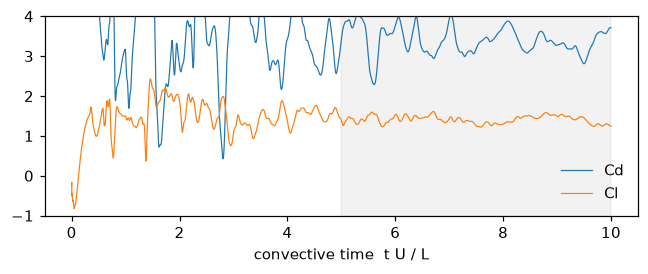

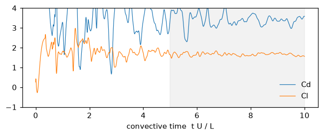

## cylinder_lbm

2D channel flow past a cylinder with the D2Q9 lattice-Boltzmann solver (pinneapple_simulation.numerical_solvers.lbm). Measures the wake regime (steady or vortex shedding) and the Strouhal number; saves vorticity snapshots labelled by regime and Re, a dataset for vision (classification / clustering of flow regimes, #415).

| run | status | Cs | D | Re | height | length | save_every | seed | steps | u_in | regime_shedding | strouhal | wake_amplitude | checks |
|---|---|---|---|---|---|---|---|---|---|---|---|---|---|---|
| [de04dbbd3e8c](runs/cylinder_lbm/cylinder_lbm-de04dbbd3e8c) | completed | 0.0 | 20 | 40 | 5 | 12 | 100 | 0 | 16000 | 0.1 | 0 | 0 | 4.7e-05 | 1/1 |
| [418823cceeb5](runs/cylinder_lbm/cylinder_lbm-418823cceeb5) | completed | 0.0 | 20 | 20 | 5 | 12 | 100 | 0 | 16000 | 0.1 | 0 | 0 | 6.269e-06 | 2/2 |
| [5e53b105e4b0](runs/cylinder_lbm/cylinder_lbm-5e53b105e4b0) | completed | 0.0 | 20 | 60 | 5 | 12 | 100 | 0 | 16000 | 0.1 | 1 | 0.225 | 0.04966 | 2/2 |
| [4347d6fb9da9](runs/cylinder_lbm/cylinder_lbm-4347d6fb9da9) | completed | 0.0 | 20 | 80 | 5 | 12 | 100 | 0 | 16000 | 0.1 | 1 | 0.25 | 0.3688 | 2/2 |
| [e254136572c5](runs/cylinder_lbm/cylinder_lbm-e254136572c5) | completed | 0.0 | 20 | 100 | 5 | 12 | 100 | 0 | 16000 | 0.1 | 1 | 0.25 | 0.5283 | 2/2 |
| [e3321156b9d5](runs/cylinder_lbm/cylinder_lbm-e3321156b9d5) | failed_validation | 0.0 | 20 | 140 | 5 | 12 | 100 | 0 | 16000 | 0.1 | 0 | 0 |  | 0/1 |
| [b20bedf5d841](runs/cylinder_lbm/cylinder_lbm-b20bedf5d841) | failed_validation | 0.0 | 20 | 180 | 5 | 12 | 100 | 0 | 16000 | 0.1 | 0 | 0 |  | 0/1 |
| [d79b20689d8c](runs/cylinder_lbm/cylinder_lbm-d79b20689d8c) | completed | 0.1 | 20 | 180 | 5 | 12 | 100 | 0 | 16000 | 0.1 | 1 | 0.25 | 0.8159 | 2/2 |
| [ea9cf6215d98](runs/cylinder_lbm/cylinder_lbm-ea9cf6215d98) | completed | 0.1 | 20 | 140 | 5 | 12 | 100 | 0 | 16000 | 0.1 | 1 | 0.25 | 0.7312 | 2/2 |

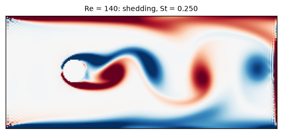

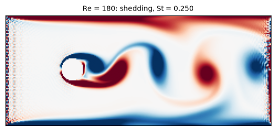

## example_script

Runs an example or use case of the repository and stores what it produced: figures, JSON outputs and their numbers as metrics, arrays as the 'artifacts' dataset, the console output and the code. The catalogue of these runs is also the health report of the examples.

| run | status | args | isolated | script | timeout | exit_code | files_produced | script_seconds | stdout.relative_l2 | stdout.relative_l2_error | checks |
|---|---|---|---|---|---|---|---|---|---|---|---|
| [ea7a7580e8be](runs/example_script/example_script-ea7a7580e8be) | running |  |  | examples/getting_started/03_heat_diffusion_1d.py | 600.0 |  |  |  |  |  | 0/0 |
| [d2cb43a85c44](runs/example_script/example_script-d2cb43a85c44) | completed |  |  | examples/getting_started/01_harmonic_oscillator.py | 600.0 | 0 | 7 | 96.21 |  | 0.915 | 1/1 |
| [76ba471d54ae](runs/example_script/example_script-76ba471d54ae) | running |  |  | examples/getting_started/02_damped_oscillator.py | 600.0 |  |  |  |  |  | 0/0 |
| [5a77c5897b1d](runs/example_script/example_script-5a77c5897b1d) | completed |  | True | examples/getting_started/01_harmonic_oscillator.py | 600.0 | 0 | 1 | 94.8 |  | 0.915 | 1/1 |
| [0ba6838478e4](runs/example_script/example_script-0ba6838478e4) | completed |  | True | examples/getting_started/02_damped_oscillator.py | 600.0 | 0 | 1 | 137 | 0.5001 |  | 1/1 |
| [f151824795db](runs/example_script/example_script-f151824795db) | failed |  | True | examples/getting_started/03_heat_diffusion_1d.py | 600.0 | -1 | 0 | 600.1 | 0.0006818 |  | 0/1 |
| [511688b89ce8](runs/example_script/example_script-511688b89ce8) | failed |  | True | examples/getting_started/04_wave_equation_1d.py | 600.0 | -1 | 0 | 600.2 |  |  | 0/1 |
| [57ffa2145319](runs/example_script/example_script-57ffa2145319) | completed |  | True | examples/getting_started/05_logistic_growth.py | 600.0 | 0 | 1 | 52.72 | 0.007669 |  | 1/1 |
| [2ab998651866](runs/example_script/example_script-2ab998651866) | completed |  | True | examples/getting_started/06_lotka_volterra.py | 600.0 | 0 | 1 | 163.6 |  |  | 1/1 |
| [3c41e93eed63](runs/example_script/example_script-3c41e93eed63) | completed |  | True | examples/getting_started/07_nonlinear_pendulum.py | 600.0 | 0 | 1 | 219.4 | 1.03 |  | 1/1 |
| [3bdda3a8019a](runs/example_script/example_script-3bdda3a8019a) | failed |  | True | examples/getting_started/08_van_der_pol.py | 600.0 | -1 | 0 | 600.2 | 1.04 |  | 0/1 |
| [a6b9305a6b2f](runs/example_script/example_script-a6b9305a6b2f) | running |  | True | examples/getting_started/09_lorenz_system.py | 600.0 |  |  |  |  |  | 0/0 |

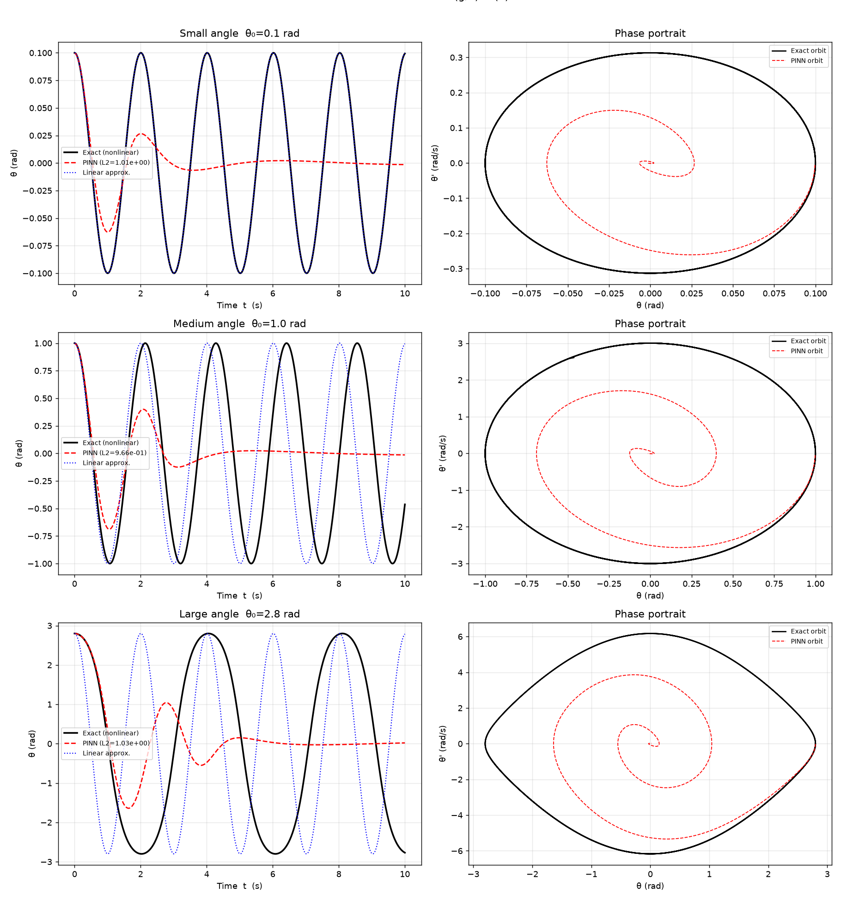

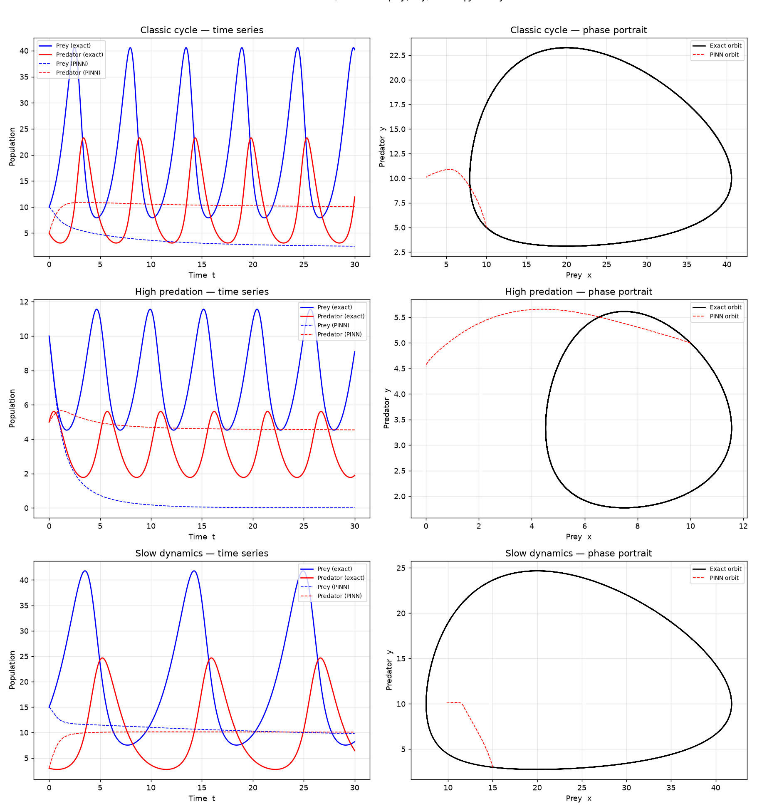

## heat_xtfc

1D heat equation u_t = alpha u_xx on [0,1] x [0,1], u0 = sin(pi x), solved by X-TFC (pinneapple_simulation.numerical_solvers.xtfc_pde) vs exp(-alpha pi^2 t) sin(pi x).

| run | status | activation | alpha | n_basis | n_collocation | seed | max_abs_error | rel_l2_error | checks |
|---|---|---|---|---|---|---|---|---|---|
| [4c4adfeb5fc2](runs/heat_xtfc/heat_xtfc-4c4adfeb5fc2) | completed | tanh | 0.01 | 20 | 25 | 0 | 0.0001011 | 4.552e-05 | 1/1 |
| [2abcbcb6d7ce](runs/heat_xtfc/heat_xtfc-2abcbcb6d7ce) | completed | sin | 0.01 | 20 | 25 | 0 | 6.423e-07 | 4.075e-07 | 1/1 |
| [dbea79e4124e](runs/heat_xtfc/heat_xtfc-dbea79e4124e) | completed | tanh | 0.01 | 60 | 25 | 0 | 3.779e-07 | 2.085e-07 | 1/1 |
| [bb25d72596fb](runs/heat_xtfc/heat_xtfc-bb25d72596fb) | completed | sin | 0.01 | 60 | 25 | 0 | 1.173e-10 | 4.992e-11 | 1/1 |
| [7eef4ced7058](runs/heat_xtfc/heat_xtfc-7eef4ced7058) | failed_validation | tanh | 0.1 | 20 | 25 | 0 | 0.001695 | 0.001413 | 0/1 |
| [87910a1ec638](runs/heat_xtfc/heat_xtfc-87910a1ec638) | completed | sin | 0.1 | 20 | 25 | 0 | 2.171e-05 | 2.087e-05 | 1/1 |
| [94269745d788](runs/heat_xtfc/heat_xtfc-94269745d788) | completed | tanh | 0.1 | 60 | 25 | 0 | 2.814e-06 | 2.026e-06 | 1/1 |
| [22bc6dad5c93](runs/heat_xtfc/heat_xtfc-22bc6dad5c93) | completed | sin | 0.1 | 60 | 25 | 0 | 9.989e-10 | 6.945e-10 | 1/1 |
| [c7a9f86bbfb0](runs/heat_xtfc/heat_xtfc-c7a9f86bbfb0) | failed_validation | tanh | 1.0 | 20 | 25 | 0 | 0.031 | 0.06418 | 0/1 |
| [71e21e11957e](runs/heat_xtfc/heat_xtfc-71e21e11957e) | failed_validation | sin | 1.0 | 20 | 25 | 0 | 0.02571 | 0.04364 | 0/1 |
| [4ae0ba0dabeb](runs/heat_xtfc/heat_xtfc-4ae0ba0dabeb) | failed_validation | tanh | 1.0 | 60 | 25 | 0 | 0.0008588 | 0.001397 | 0/1 |
| [fe8b4a9756b7](runs/heat_xtfc/heat_xtfc-fe8b4a9756b7) | completed | sin | 1.0 | 60 | 25 | 0 | 0.0001163 | 0.0002403 | 1/1 |

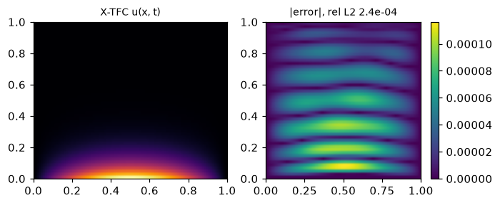

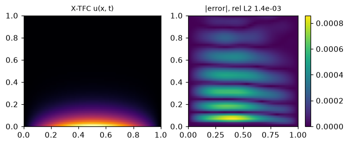

## kepler_law

Discover Kepler's third law from real orbital data (planets, moons of Jupiter and Saturn): sparse regression over power laws finds P ∝ a^n, n is compared with 3/2, the central masses come out as GM, and all three systems collapse onto P = 2π sqrt(a^3 / GM).

| run | status | exponent_grid | seed | Jupiter_GM_rel_error | Jupiter_exponent | Saturn_GM_rel_error | Saturn_exponent | Sun_GM_rel_error | Sun_exponent | checks |
|---|---|---|---|---|---|---|---|---|---|---|
| [2c94b68c58a3](runs/kepler_law/kepler_law-2c94b68c58a3) | completed | 0.25 | 0 | 0.0004799 | 1.5 | 0.00123 | 1.501 | 0.0005239 | 1.5 | 7/7 |

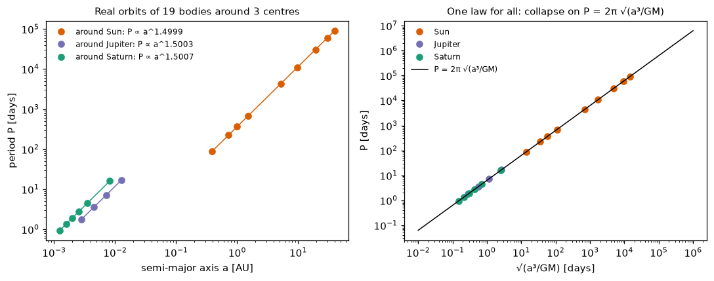

## lorenz_discovery

AI-Lorenz style equation discovery (De Florio, Kevrekidis & Karniadakis 2024): noisy, subsampled observations of the Lorenz system are fitted window by window with an extreme learning machine (the free function of X-TFC), whose analytic derivatives feed SINDy over quadratic monomials; the recovered system is integrated and compared with the true attractor.

| run | status | beta | dt | noise | rho | seed | sigma | subsample | t_end | threshold | beta | max_coefficient_rel_error | prediction_horizon_lyapunov_times | rho | sigma | checks |
|---|---|---|---|---|---|---|---|---|---|---|---|---|---|---|---|---|
| [f76bfaeab75f](runs/lorenz_discovery/lorenz_discovery-f76bfaeab75f) | completed | 2.6666666666666665 | 0.005 | 0.01 | 28.0 | 0 | 10.0 | 4 | 20.0 | 0.08 | 2.665 | 0.01778 | 3.801 | 28.03 | 10.02 | 2/2 |

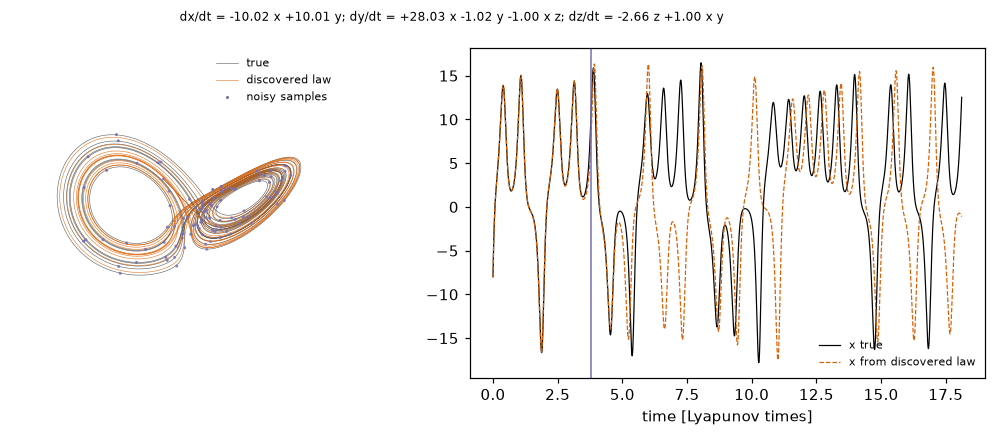

## oscillator

Damped harmonic oscillator x'' + 2 zeta omega x' + omega^2 x = 0: integrator vs exact solution.

| run | status | dt | method | omega | seed | t_end | zeta | max_abs_error | omega_dt | rmse | checks |
|---|---|---|---|---|---|---|---|---|---|---|---|
| [0442136ce607](runs/oscillator/oscillator-0442136ce607) | completed | 0.012885592063752185 | euler | 9.223687118766923 | 0 | 20.0 | 1.3870553097049836 | 0.01122 | 0.1189 | 0.001669 | 2/2 |
| [97053ea14b88](runs/oscillator/oscillator-97053ea14b88) | completed | 0.0019641163321943204 | rk4 | 1.616674352282638 | 0 | 20.0 | 0.9473678965549043 | 8.651e-13 | 0.003175 | 1.834e-13 | 2/2 |
| [057e3f2dd66a](runs/oscillator/oscillator-057e3f2dd66a) | completed | 0.004954188819558289 | rk4 | 0.8244625852776364 | 0 | 20.0 | 0.11056792267363594 | 7.663e-12 | 0.004085 | 4.589e-12 | 2/2 |
| [04d4a6349562](runs/oscillator/oscillator-04d4a6349562) | completed | 0.0033250672987854705 | rk4 | 0.8032061536399775 | 0 | 20.0 | 0.5397375515521012 | 3.134e-13 | 0.002671 | 1.096e-13 | 2/2 |
| [791703425065](runs/oscillator/oscillator-791703425065) | completed | 0.002861067635189222 | rk4 | 1.5742812178309347 | 0 | 20.0 | 0.7256122669373342 | 2.373e-12 | 0.004504 | 5.814e-13 | 2/2 |
| [8c284c3882d4](runs/oscillator/oscillator-8c284c3882d4) | completed | 0.005801881913762104 | symplectic | 1.9526458502758697 | 0 | 20.0 | 0.04183649717882347 | 0.005657 | 0.01133 | 0.003244 | 2/2 |
| [d3a71b25ea04](runs/oscillator/oscillator-d3a71b25ea04) | completed | 0.0018811366140411916 | rk4 | 0.7003211418465322 | 0 | 20.0 | 0.29797721549084555 | 3.336e-14 | 0.001317 | 1.539e-14 | 2/2 |
| [d2d90700043b](runs/oscillator/oscillator-d2d90700043b) | completed | 0.001055816294361119 | symplectic | 0.7621527673671995 | 0 | 20.0 | 1.195670633238918 | 0.0002274 | 0.0008047 | 7.451e-05 | 2/2 |
| [80fc2d7c5f12](runs/oscillator/oscillator-80fc2d7c5f12) | completed | 0.03694120763470103 | euler | 2.044821255379227 | 0 | 20.0 | 1.0971380066677485 | 0.01039 | 0.07554 | 0.002761 | 2/2 |
| [1f46f99b6b59](runs/oscillator/oscillator-1f46f99b6b59) | completed | 0.0021788817648673024 | euler | 5.746692058560777 | 0 | 20.0 | 1.266508884513013 | 0.001336 | 0.01252 | 0.0002345 | 2/2 |
| [ff857ab7a67f](runs/oscillator/oscillator-ff857ab7a67f) | completed | 0.0031943332502127175 | symplectic | 3.5075541267039467 | 0 | 20.0 | 1.2061388066810794 | 0.003156 | 0.0112 | 0.0004816 | 2/2 |
| [5e5f0a9633be](runs/oscillator/oscillator-5e5f0a9633be) | completed | 0.02776797432596831 | rk4 | 0.8791711072634142 | 0 | 20.0 | 1.4942129249724063 | 9.124e-09 | 0.02441 | 1.829e-09 | 2/2 |
| [66dd9684d466](runs/oscillator/oscillator-66dd9684d466) | completed | 0.0342501479986307 | rk4 | 5.492535571800476 | 0 | 20.0 | 0.6552918685651878 | 7.593e-06 | 0.1881 | 9.987e-07 | 2/2 |
| [22cdb530644f](runs/oscillator/oscillator-22cdb530644f) | completed | 0.01400097499631986 | symplectic | 2.6316058876702564 | 0 | 20.0 | 1.2457818708666115 | 0.01023 | 0.03685 | 0.0018 | 2/2 |
| [5aa1c7f37cbb](runs/oscillator/oscillator-5aa1c7f37cbb) | completed | 0.012216311567499392 | euler | 4.693201574143115 | 0 | 20.0 | 0.8515679480642693 | 0.0116 | 0.05733 | 0.00179 | 2/2 |
| [bd18adec8a8f](runs/oscillator/oscillator-bd18adec8a8f) | completed | 0.04567944555451056 | rk4 | 6.25597781266593 | 0 | 20.0 | 0.07063719533483889 | 0.0002926 | 0.2858 | 9.52e-05 | 2/2 |
| [2e7a5fa8790a](runs/oscillator/oscillator-2e7a5fa8790a) | completed | 0.04761448609092085 | rk4 | 0.6355991112461176 | 0 | 20.0 | 1.0541126816618527 | 9.45e-09 | 0.03026 | 2.906e-09 | 2/2 |
| [a79515969a1a](runs/oscillator/oscillator-a79515969a1a) | completed | 0.0014884765278563973 | rk4 | 5.9586179318190675 | 0 | 20.0 | 0.30937867491241605 | 6.419e-11 | 0.008869 | 1.008e-11 | 2/2 |
| [9d7e625ccd11](runs/oscillator/oscillator-9d7e625ccd11) | completed | 0.0014291466263210968 | symplectic | 1.8647229988586413 | 0 | 20.0 | 0.2579184541639241 | 0.001236 | 0.002665 | 0.0003398 | 2/2 |
| [2b869c0c3d7e](runs/oscillator/oscillator-2b869c0c3d7e) | completed | 0.022334036970504845 | euler | 0.5193579949374877 | 0 | 20.0 | 0.9172834258819436 | 0.002054 | 0.0116 | 0.0009867 | 2/2 |
| [d1d5ccd8a219](runs/oscillator/oscillator-d1d5ccd8a219) | completed | 0.0037774365605841524 | symplectic | 3.877764715355997 | 0 | 20.0 | 0.12946429695435932 | 0.007169 | 0.01465 | 0.001834 | 2/2 |
| [c3bf80d06918](runs/oscillator/oscillator-c3bf80d06918) | completed | 0.04108334858474703 | symplectic | 1.2559363221498139 | 0 | 20.0 | 0.20990640405542466 | 0.02463 | 0.0516 | 0.008944 | 2/2 |
| [5f030afd29d1](runs/oscillator/oscillator-5f030afd29d1) | completed | 0.002558128640927086 | euler | 1.315303781720961 | 0 | 20.0 | 0.8001456148776995 | 0.0007248 | 0.003365 | 0.0002078 | 2/2 |
| [0ae45f86d504](runs/oscillator/oscillator-0ae45f86d504) | completed | 0.00108844325803353 | euler | 8.816440753699911 | 0 | 20.0 | 1.0315623678187527 | 0.001418 | 0.009596 | 0.0001757 | 2/2 |
| [85d06988710e](runs/oscillator/oscillator-85d06988710e) | completed | 0.0036395998173508106 | euler | 3.7075809366017505 | 0 | 20.0 | 1.1605297203557239 | 0.001658 | 0.01349 | 0.0003407 | 2/2 |
| [c35c9bbd1fe7](runs/oscillator/oscillator-c35c9bbd1fe7) | completed | 0.02515979142526455 | symplectic | 1.1814625816513138 | 0 | 20.0 | 0.4526480309176831 | 0.0125 | 0.02973 | 0.003598 | 2/2 |
| [907c90d29816](runs/oscillator/oscillator-907c90d29816) | completed | 0.006318138191817069 | euler | 7.622271840820334 | 0 | 20.0 | 1.3658289986509138 | 0.004585 | 0.04816 | 0.0007398 | 2/2 |
| [24119609f45a](runs/oscillator/oscillator-24119609f45a) | completed | 0.011371309939945087 | symplectic | 4.1504895252131755 | 0 | 20.0 | 0.33451060674716326 | 0.0212 | 0.0472 | 0.003556 | 2/2 |
| [158a279ad88f](runs/oscillator/oscillator-158a279ad88f) | completed | 0.021348309540644487 | rk4 | 1.1000024296478488 | 0 | 20.0 | 0.9681323484519061 | 2.775e-09 | 0.02348 | 6.996e-10 | 2/2 |
| [65ee0f1ccc6c](runs/oscillator/oscillator-65ee0f1ccc6c) | completed | 0.03159900215656863 | symplectic | 6.576081418270312 | 0 | 20.0 | 1.29134665027671 | 0.05807 | 0.2078 | 0.006358 | 2/2 |

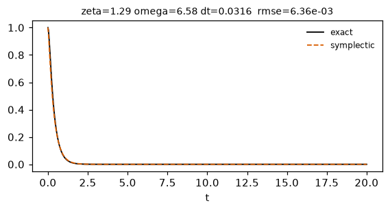

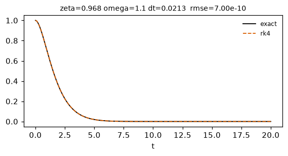

## oscillator_discovery

Uses the oscillator trajectories already in the lab database: for each one, SINDy over {x, x', x², x x', x'²} finds x'' = -ω² x - 2ζω x' and recovers ζ and ω from the data alone.

| run | status | max_runs | seed | threshold | n_trajectories | omega_rel_error_median | zeta_abs_error_median | checks |
|---|---|---|---|---|---|---|---|---|
| [d0a08fc3b799](runs/oscillator_discovery/oscillator_discovery-d0a08fc3b799) | completed | 200 | 0 | 0.02 | 20 | 4.667e-06 | 3.776e-06 | 2/2 |

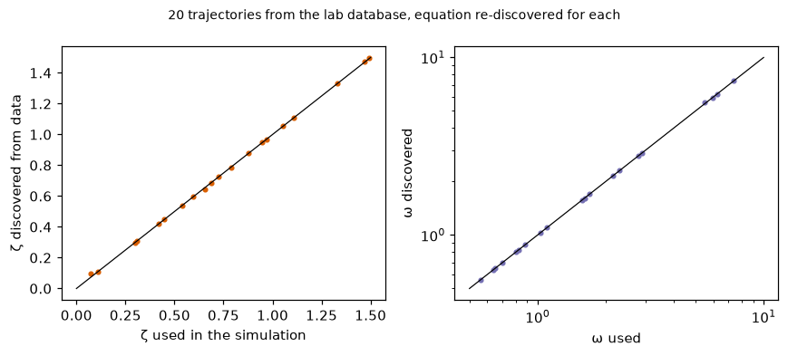

## pendulum_video

Law -> video -> law -> video. A large-amplitude damped pendulum is filmed (rendered with camera noise and motion blur); its angle is measured from the frames; weak-form SINDy discovers θ'' = -(g/L) sin θ - c θ' from a library that also offers θ, θ³, cos θ, θ'|θ'|, ...; the discovered law is re-simulated and re-rendered, and the predicted video is compared with the observed one, including after the observation window.

| run | status | L | damping | fps | g | n_test | noise | predict_seconds | seconds | seed | size | test_width | theta0 | angle_measurement_rmse_rad | damping_discovered | forecast_rmse_rad | g_discovered | g_rel_error | n_terms | checks |
|---|---|---|---|---|---|---|---|---|---|---|---|---|---|---|---|---|---|---|---|---|
| [7a4bc9625e0e](runs/pendulum_video/pendulum_video-7a4bc9625e0e) | completed | 0.8 | 0.15 | 60 | 9.81 | 120 | 0.04 | 6.0 | 10.0 | 0 | 160 | 2.0 | 2.4 | 0.01516 | 0.152 | 0.009488 | 9.787 | 0.002353 | 2 | 3/3 |

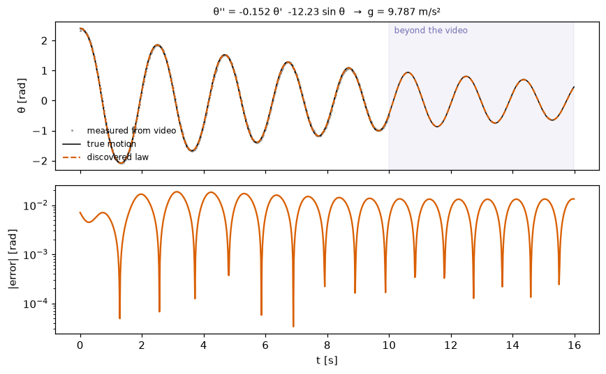

## repo_results

Results already produced by repository scripts (PINNs, inverse problems, LBM, MeshGraphNet, black-hole forecasts), re-validated against their references and stored as datasets.

| run | status | source | CL_max | CL_rms_vs_polhamus | CL_slope_per_rad | St_cylinder_h10 | St_cylinder_h20 | St_naca4412 | checks |
|---|---|---|---|---|---|---|---|---|---|
| [96e87a293dea](runs/repo_results/repo_results-96e87a293dea) | completed | burgers_pinn |  |  |  |  |  |  | 1/1 |
| [fa808c1e7a31](runs/repo_results/repo_results-fa808c1e7a31) | completed | lbm_strouhal |  |  |  | 0.1915 | 0.1742 | 0.2068 | 3/3 |
| [cbac6f31f681](runs/repo_results/repo_results-cbac6f31f681) | completed | meshgraphnet |  |  |  |  |  |  | 2/2 |
| [ae7814d939d6](runs/repo_results/repo_results-ae7814d939d6) | completed | concorde_aoa | 0.5881 | 0.2409 | 1.728 |  |  |  | 2/2 |
| [269f1207b6f2](runs/repo_results/repo_results-269f1207b6f2) | completed | bh_forecast |  |  |  |  |  |  | 2/2 |
| [8f10f262c734](runs/repo_results/repo_results-8f10f262c734) | completed | fin_inverse_2d |  |  |  |  |  |  | 3/3 |
| [e9574ff86021](runs/repo_results/repo_results-e9574ff86021) | completed | fin_inverse_3d |  |  |  |  |  |  | 3/3 |
| [33073ba61b6c](runs/repo_results/repo_results-33073ba61b6c) | completed | heatsink_surrogate |  |  |  |  |  |  | 3/3 |
| [d8795900891a](runs/repo_results/repo_results-d8795900891a) | completed | airfoil_surrogate |  |  |  |  |  |  | 2/2 |

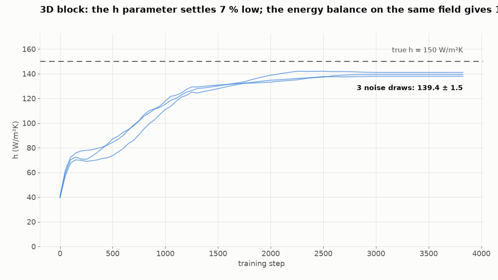

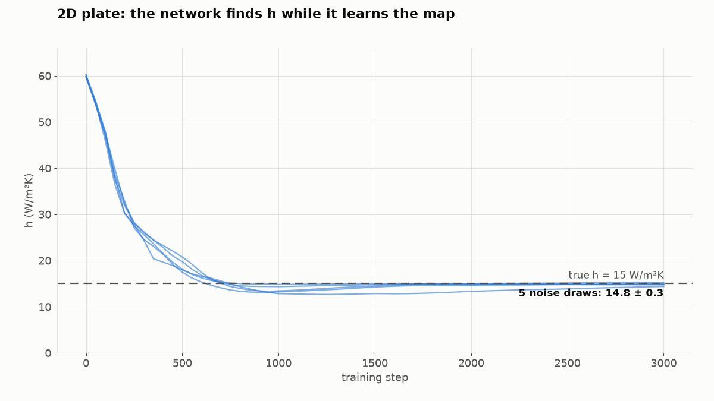

## vehicle_cfd

A parametric 3-D road car or launch vehicle in OpenFOAM (snappyHexMesh + simpleFoam, half model): drag, lift, skin pressure, streamlines and wake, checked against reference ranges (car) or Barrowman's stability equations (rocket); Blender Cycles renders and a 3-D viewer.

| run | status | alpha | iterations | keep_case | procs | resolution | samples | slant_deg | speed | style | surface_level | vehicle | checks |
|---|---|---|---|---|---|---|---|---|---|---|---|---|---|
| [19b6c3f7bb85](runs/vehicle_cfd/vehicle_cfd-19b6c3f7bb85) | running | 4.0 | 600 | False | 2 | coarse | 96 | 22.0 | 30.0 | fastback | None | car | 0/0 |
